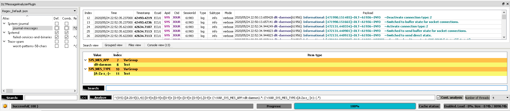
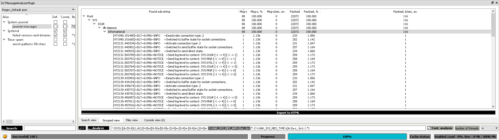
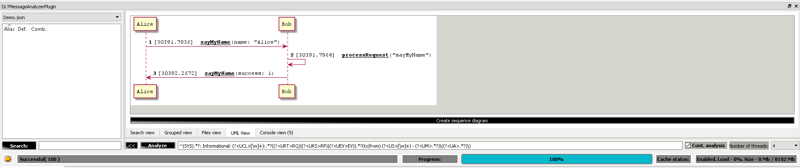

## Please, support!

If you are an active user of the DLT-Message-Analyzer plugin - please, spend a few moments to star this GitHub repository. Our team will very much appreciate it!

----

## v.1.0.29 released!

New features in release v.1.0.29:

- [Coverage note](./md/coverage_note/coverage_note.md)
- [Grouped view highlighting](./md/grouped_view/grouped_view.md#highlighting-the-group-in-the-search-view)
- [Regex history](.//md/search/search.md#regex-history)

## Implemented features targeted for release v1.0.30:

Use the HEAD revision to try out the following features:

- [Grouped view default application is disabled](./md/grouped_view/grouped_view.md#backward-compatibility-note)
- [Groups nesting ordering](./md/grouped_view/grouped_view.md#groups-nesting-ordering)
- [Plot legend scrolling](./md/plot_view/plot_view.md#legend-scrolling)
- [Regex group name glossary](./md/search/search.md#regex-group-name-glossary)
- [Regex text editor with the automatic height adjustment](./md/search/search.md#regex-text-editor)

----

----

----

## What is DLT Message Analyzer?

The DLT Message Analyzer plugin is the perfect tool for anyone looking to increase their analytical capabilities when using the dlt-viewer SW. With this plugin, users can quickly and easily analyze logs, allowing them to gain valuable insights into their data. The plugin is easy to use and provides users with a comprehensive set of features to help them make the most of their data.

The DLT Message Analyzer works in combination with the **[following source code](https://github.com/GENIVI/dlt-viewer)**.

There are the following schemas of deployment:

|#|Approach|Diagram|Comment|Used components|Active connection to the target|
|---|---|-----|---|---|---|
|1|Deploy dlt-daemon on the target device. Forward applications output to the dlt-daemon. Use dlt-viewer on the host machine, to fetch data from the dlt-daemon. Use DLT Message Analyzer for logs analysis inside the dlt-viewer.|[DLT Message Analyzer plugin - deployment approach 1](./md/dlt_message_analyzer_approach_1.png)|The classical approach. dlt-daemon is running on the target side, e.g. on the multi-media board inside the vehicle.|dlt-daemon, dlt-viewer, DLT Message Analyzer|+|
|2|Deploy dlt-daemon on the host machine. Connect to the target over the ssh and forward data to the dlt-daemon, using bash or Python "glue-scripting". Use dlt-viewer on the host machine, to fetch data from the dlt-daemon. Use DLT Message Analyzer for logs analysis inside the dlt-viewer.|[DLT Message Analyzer plugin - deployment approach 2](./md/dlt_message_analyzer_approach_2.png)|Alternative approach, which allows to connect to the localhost inside the dlt-viewer and get the data without deploying dlt-daemon on the target device.|dlt-daemon, dlt-viewer, DLT Message Analyzer, glue-code|+|
|3|Collect the logs from the target to a text document. Use the DLT Message Analyzer debug console command 'convert-txt-to-dlt-file' to convert any textual data to dlt format. Open the resulting dlt file in the dlt-viewer. Use DLT Message Analyzer for logs analysis inside the dlt-viewer.|[DLT Message Analyzer plugin - deployment approach 3](./md/dlt_message_analyzer_approach_3.png)|A simplistic approach for those, who is not interested in fetching data into the dlt-viewer directly from the target. More details on the console commands **[here](./md/debug_console/debug_console.md)**.|dlt-viewer, DLT Message Analyzer|-|

**Note** If you are new to the dlt-viewer and, espacially, to the dlt-daemon, we propose you to use the **deployment approach #3**.

----

## Installation guide

### [Read it here](./md/installation_guide/installation_guide.md)

----

## Feature-set:

### [Search](./md/search/search.md)

- Validation of the entered regular expressions with providing human-readable error in case of the wrong input
- Continuous search. The analysis ongoing, while new messages are being received from the target device 

### [In-RAM cache](./md/in_ram_cache/in_ram_cache.md)

- Makes search dramatically fast

### [Grouped view](./md/grouped_view/grouped_view.md)

- Allows you to easily form groups of the repetitive messages and check trace-spam cases, request-response pairs, number of message occurrences, etc.

### [Filters view](./md/filters_view/filters_view.md)

- Allows you to quickly get access to the defined "key regex groups" and change their content
- Provides auto-completion functionality

### [Advanced highlighting](./md/advanced_highlighting/advanced_highlighting.md)

- Advanced highlighting of regex groups
- Possibility to copy-paste highlighted content into your emails to increase their readability

### [Patterns view](./md/patterns_view/patterns_view.md)

- Possibility to save regex patterns with the human-readable aliases
- Possibility to use combinations of the saved regex patterns, which allows you to instantly form the complex requests. This incredibly increases the speed and quality of the trace analysis!
- Possibility to work with multiple regex configuration files and switch between them. This allows you to use other's domains knowledge in your analysis
- Possibility to search patterns by their aliases

### [Search view](./md/search_view/search_view.md)

- Analog of the dlt-viewer's search with the extended capabilities
- Possibility to lock the search between the 2 message id-s

### [Integration with PlantUML](./md/plant_uml/plant_uml.md)

- Plugin supports integration with the PlantUML tool, which allows you to create sequence diagrams out of the logs

### [Plot view](./md/plot_view/plot_view.md)

- Plugin supports integration with the QCustomPlot library, which allows you to create plots out of the logs

### [Coverage note](./md/coverage_note/coverage_note.md)

- Plugin supports creation of the coverage note and exporting it to JSON and HTML formats

### [Files view](./md/files_view/files_view.md)

- Extension, which lists the paths & names of all currently opened DLT files

### [Debug console](./md/debug_console/debug_console.md)

- Debug "console view", which shows debug messages of the plugin and allows you to perform a set of predefined scenarios.
- In addition, console view allows you to convert custom txt files into the dlt format. Thus, you can use dlt-viewer for the projects, which do not use full Genivi DLT infrastructure. E.g. no dlt-daemon or dlt API lib being used.

and many other features

----

## Troubleshooting

### [Read it here](./md/troubleshooting/troubleshooting.md)

----

## Thirdparty dependencies: 

### [Read it here](./md/thirdparty_deps/thirdparty_deps.md)

----

## Development documentation

### [Read it here](./md/dev_docs/dev_docs.md)

----

## Repo size: 

### [Read it here](./md/repo_size/repo_size.md)

----

## Screenshots:

----

----

