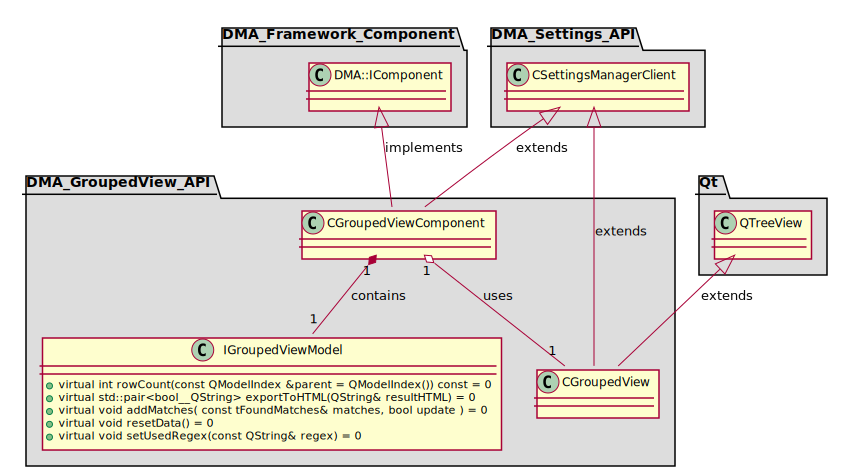
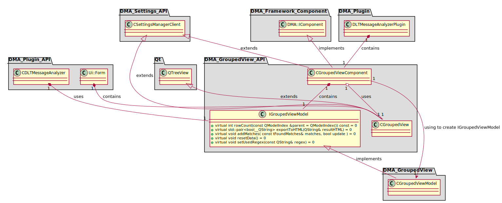
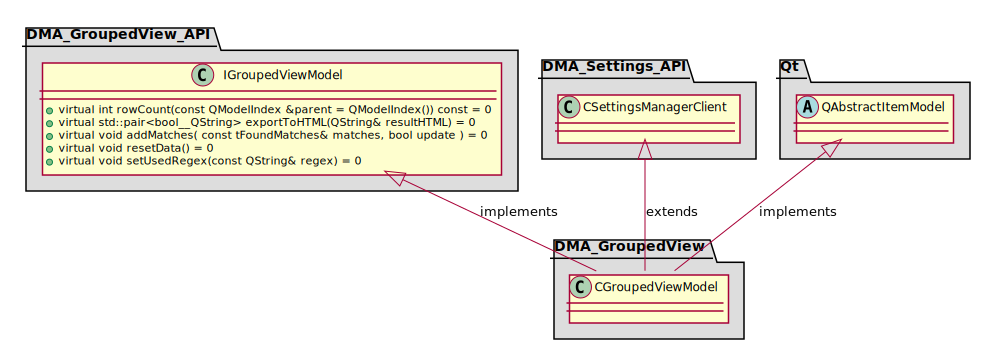
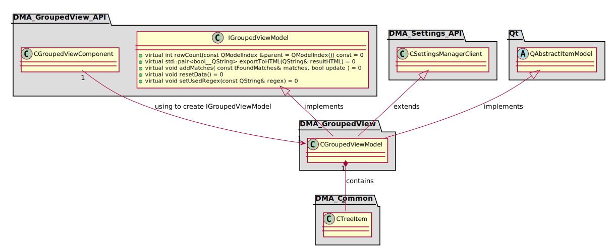

[**Go to the previous page**](../../../../../md/dev_docs/dev_docs.md)

----

# DMA_GroupedView

## Standalone package API diagram

## Package API diagram with the first-level dependencies

## Standalone package diagram

## Package diagram with the first-level dependencies

----

[**Go to the previous page**](../../../../../md/dev_docs/dev_docs.md)