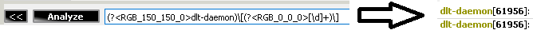
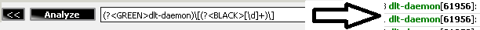
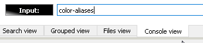
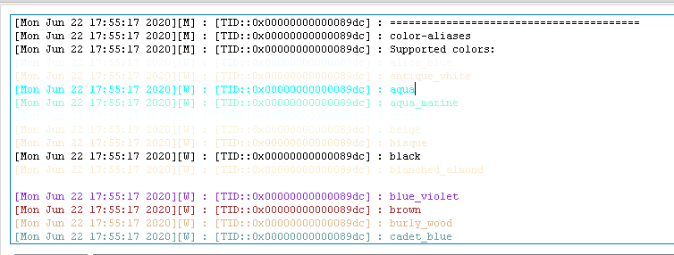

[**Go to the previous page**](../../README.md)

----

# Advanced highlighting

DLT Message Analyzer plugin supports regex name scripting. It means, that the provided regex name might be considered by the implementation of the plugin and used by it in this or that view.

One of the supported options is the advanced highlighting of the found messages.

----

By default, the plugin will highlight each regex group with some color. Default colors depend on the used user settings. By default, it will be a repetitive gradient consisting of 5 colors:

User can exchange the gradient settings in the context menu of the "Search view":

The default coloring can be overwritten by a regex name script.

Supported syntax options are:

**RGB_R_G_B** => e.g. RGB_0_0_0 stands for black:

**Color name** => e.g. BLACK:

**Status name** => e.g. ERROR:

Supported statuses are:

{"ok", QColor(0,150,0)}, 
{"warning", QColor(150,150,0)}, 
{"error", QColor(150,0,0)}

Coloring of the nested groups is also supported:

All the above parameters are case insensitive.

----

# Supported color names

To get the list of the supported color aliases, please, switch to the "Console view" tab, and enter the "color-aliases" command:

[**Go to the previous page**](../../README.md)