[**Go to the previous page**](../../README.md)

----

# Table of Contents

- [Coverage note](#coverage-note)
  - [Use-case](#use-case)
  - [How does it look?](#how-does-it-look)
- [Working with coverage note items](#working-with-coverage-note-items)
  - [Adding the coverage note item](#adding-the-coverage-note-item)
    - [From the search view](#from-the-search-view)
      - [Adding the coverage note item from the main table](#adding-the-coverage-note-item-from-the-main-table)
      - [Adding the coverage note item from the search view](#adding-the-coverage-note-item-from-the-search-view)
    - [From the coverage note view](#from-the-coverage-note-view)
      - [Adding the coverage note item from the main table](#adding-the-coverage-note-item-from-the-main-table-1)
      - [Adding the 'general' coverage note item](#adding-the-general-coverage-note-item)
      - [Adding the 'files data' coverage note item](#adding-the-files-data-coverage-note-item)
  - [Deleting the coverage note item](#deleting-the-coverage-note-item)
  - [Moving the coverage note item](#moving-the-coverage-note-item)
    - [Moving the coverage note item up](#moving-the-coverage-note-item-up)
    - [Moving the coverage note item down](#moving-the-coverage-note-item-down)
- [Working with the coverage note](#working-with-the-coverage-note)
  - [Creating a new coverage note](#creating-a-new-coverage-note)
  - [Opening the coverage note](#opening-the-coverage-note)
  - [Saving the coverage note](#saving-the-coverage-note)
    - [Save](#save)
    - [Save as](#save-as)
  - [Exporting the coverage note as HTML](#exporting-the-coverage-note-as-html)

# Coverage note

## Use-case

I want to create a coverage note within the plugin as a developer.

That is needed to:

- decrease ticket processing time
- increase the coverage note data readability
- increase the coverage note data reusability. For example, I want to be able to quickly apply all search queries of some previously analyzed ticket to a new data set
- increase the level of the coverage note data structure

It should be possible to:

- Add a coverage note item from the "search view" to the coverage note:
  - The coverage note item should contain messages selected in the "search view" of the plugin.
  - The coverage note item should also include the regular expression used for the search.
  - The messages should be stored in this coverage note item with the HTML highlighting.
  - It should be possible to trigger a search using the regex stored in this coverage note item.
- Add a coverage note item from the main dlt-viewer's table to the coverage note:
  - The coverage note item should contain messages selected in the main dlt-viewer's table.
- Add a 'general' coverage note item:
  - Adding a generic coverage note item that is not tied to specific messages should be possible.
- Add a 'used files' coverage note item:
  - It should be possible to add a coverage note item that describes which DLT files were used during the analysis.
- Provide a user's comment for each stored coverage note item.
- Store the 'creation date', 'username', 'messages', 'comment', and 'regex' fields for each created coverage note item.
- Store the coverage note as a JSON file.
- Open previously saved coverage note files.
- Change the order of the added coverage note items.
- Delete and edit existing coverage note items.
- Export the coverage note to HTML so that it can be viewed by users not using the DLT viewer.
- Observe the name of the currently opened coverage note file.
- Provide the username to be used for the created coverage note items.

All the functionality described above is made possible by the DLT Message Analyzer plugin.

## How does it look?

The coverage note functionality is provided by:

- The "coverage note view" tab of the plugin
- The "search view" tab of the plugin

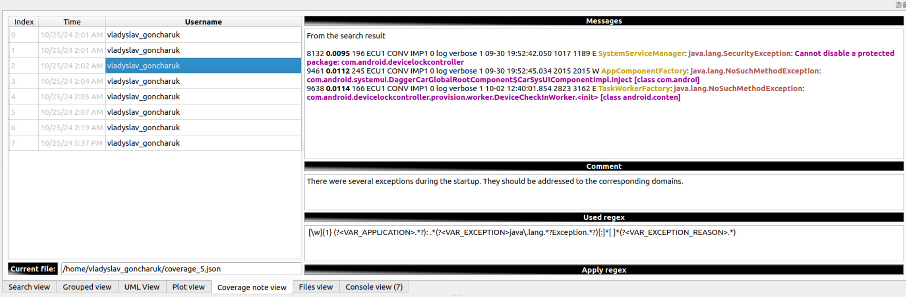

----

## Working with coverage note items

### Adding the coverage note item

You can add new coverage note items to the coverage note in several ways.

#### From the search view

##### Adding the coverage note item from the main table

- Open any \*.dlt file and select some messages in the main dlt-viewer's table:

  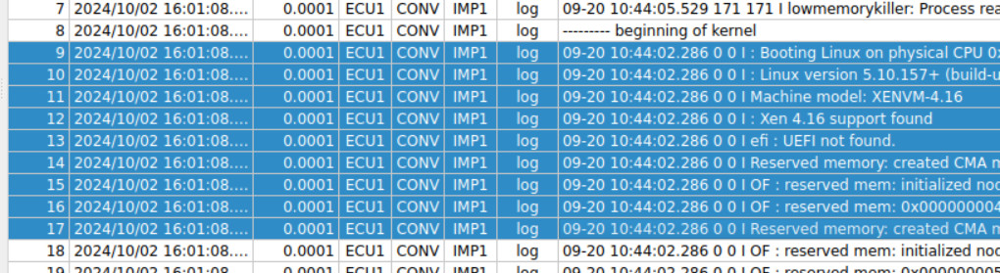

- Switch to the "search view" and use the context menu or 'Ctrl+Alt+M' shortcut to add new coverage note item:

  
  
- You will be switched to the 'coverage note view'. You can edit your newly added coverage note item there:

  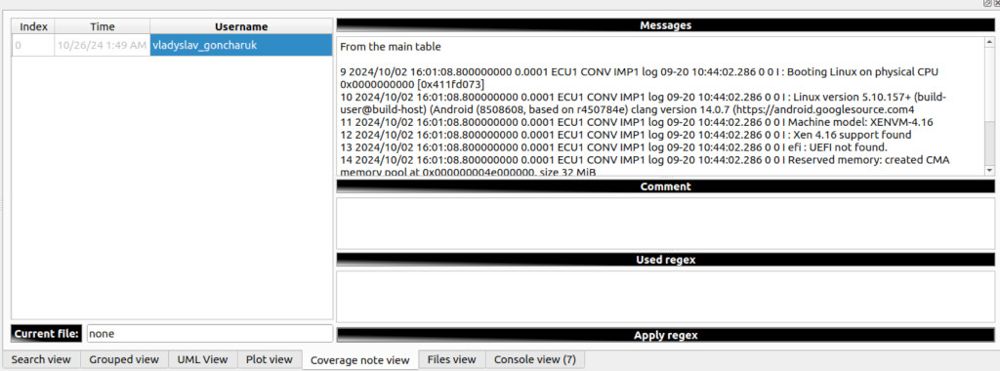

##### Adding the coverage note item from the search view

- Open any \*.dlt file, start the search in the DLT Message Analyzer, and select some of the messages that you want to make part of the new coverage note item:

  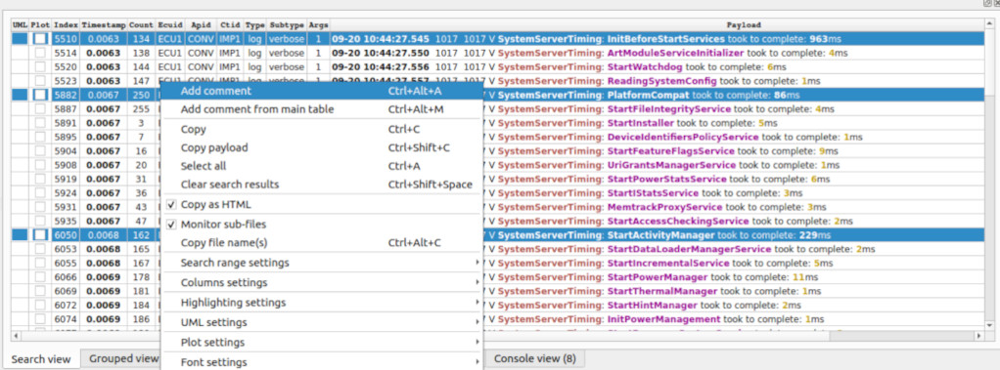

- You will be switched to the 'coverage note view'. You can edit your newly added coverage note item there:

  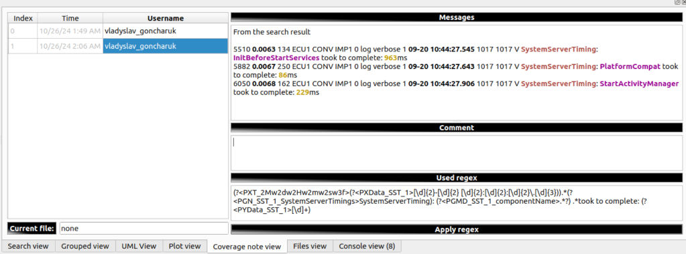

  **Note!** The search result messages are stored with the preserved highlighting.
  
- The regex field will be filled in for such cases. Using the saved regular expression, you can trigger a search using the "Apply regex" button.

#### From the coverage note view

##### Adding the coverage note item from the main table

Apply the same steps mentioned for the "search view" to the "coverage note view." It has the same context menu item and the same shortcut.

##### Adding the 'general' coverage note item

- Open the "coverage note view". Use the "Add comment" context menu item or "Ctrl+Alt+A" shortcut to add a new coverage note item:

  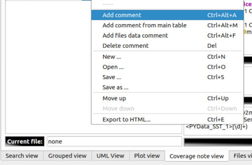

- This coverage note item will have no stored messages. It will be marked as a general coverage note item:

  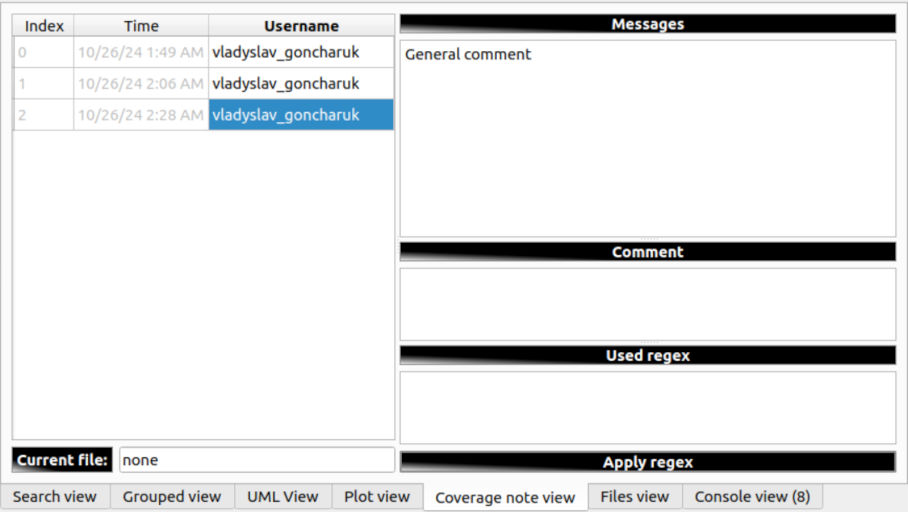

- You can edit your coverage note item message and add further coverage note items.

##### Adding the 'files data' coverage note item

- Open the "coverage note view". Use the "Add files data comment" context menu item or "Ctrl+Alt+F" shortcut to add a corresponding type of the coverage note item:

  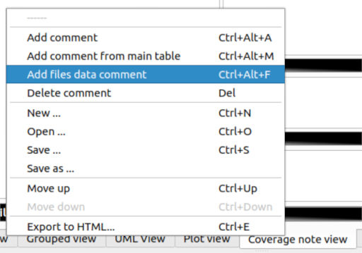

- This coverage note item will have a set of opened dlt files in the "Messages" section:

  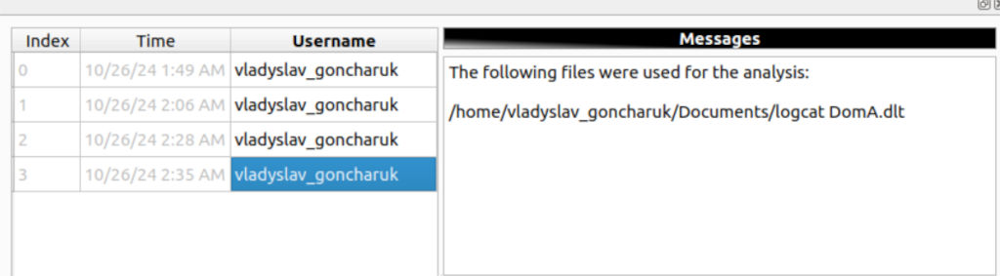

- You can edit your coverage note item message and add further note items if needed.

----

### Deleting the coverage note item

- Open the "coverage note view". Select the message you want to delete. Use the "Delete comment" context menu item or 'Del' key to delete the selected message:

  

- Confirm the deletion operation:

  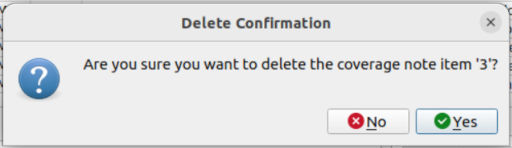

- The item will be deleted:

  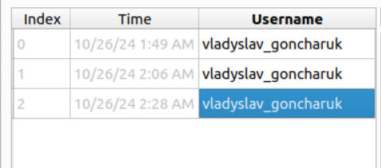  

----

### Moving the coverage note item

You can reorder coverage note items within the coverage note.

#### Moving the coverage note item up

- Open the "coverage note view". Select one of the coverage note items. Select the "Move up" context menu item or the "Ctrl + ArrowUp" shortcut to move the target coverage note item up:

  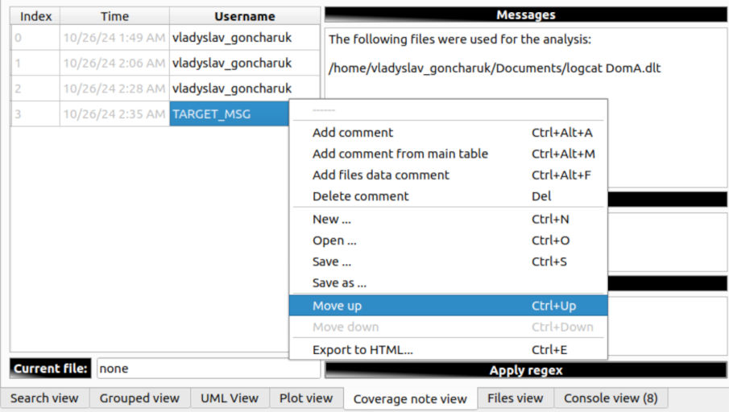

The change will be applied:

  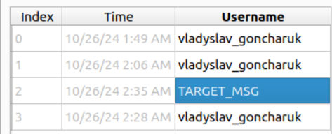

#### Moving the coverage note item down

Follow the instructions for moving up, but use the "Move down" context menu item or the "Ctrl + ArrowDown" shortcut instead.

----

## Working with the coverage note

### Creating a new coverage note

- Open the "coverage note view". Use the "New ..." context menu item or "Ctrl+N" shortcut to create a new coverage note:

  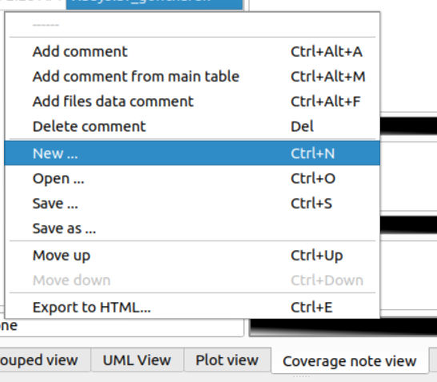

- You will be prompted in case your previous work is not saved:

  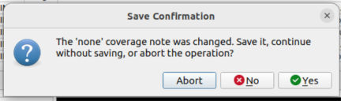

### Opening the coverage note

- Open the "coverage note view". Use the "Open ..." context menu item or "Ctrl+O" shortcut to create a new coverage note:

  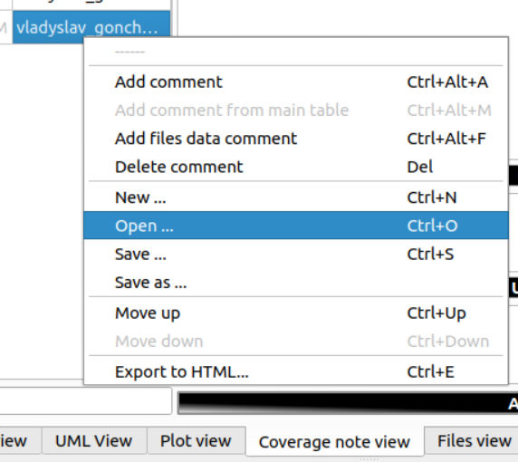

- The pop-up menu will allow you to select the target JSON file.

### Saving the coverage note

#### Save

- Open the "coverage note view". Use the "Save ..." context menu item or "Ctrl+S" shortcut to save a coverage note:

  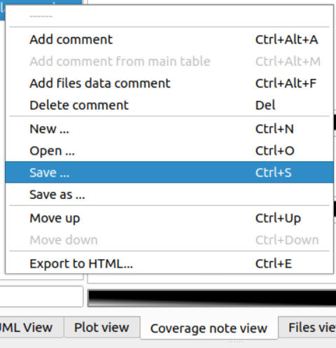

- If it is a new coverage note, a pop-up menu will appear, allowing you to select the target file path and name.

#### Save as

- Open the "coverage note view". Use the "Save as ..." context menu item or "Ctrl+S" shortcut to create a new coverage note:

  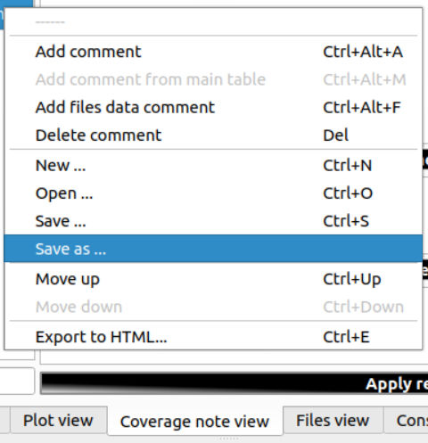

- The pop-up menu will allow you to select the target file path and name.

### Exporting the coverage note as HTML

- Open the "coverage note view". Use the "Save as ..." context menu item or "Ctrl+S" shortcut to create a new coverage note:

  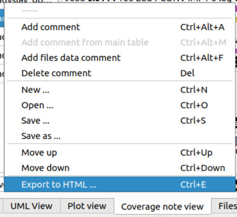

- The pop-up menu will allow you to select the target file path and name.

- The resulting HTML file will look like this:

  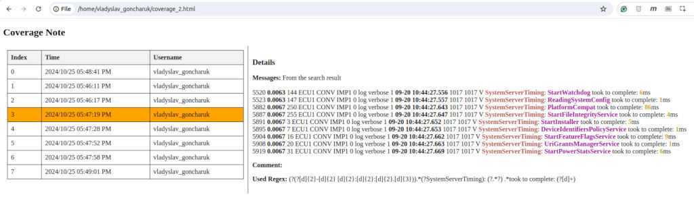

- Click on items in the table to switch between the coverage note item details.

----

[**Go to the previous page**](../../README.md)
