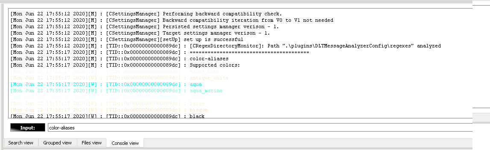
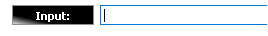

[**Go to the previous page**](../../README.md)

----

# Debug console

The plugin contains the debug console, which prints different kinds of debug messages, which are sent by the plugin's implementation. 
Also, it supports callbacks, which can be triggered via the user's textual input.
Some of the supported callbacks do consider the user's input parameters.

----

## How does it look like?

----

> **Note!**
>
> Console is mainly used during the development phase. 
> It is the output channel for the plugin's messages. Some sort of alternative to the standard output stream.
> Beside that, it allows the user to generate SW's class-diagrams and request specific debug output.

----

Despite the fact, that majority of the messages are disabled in production SW, some of them are intentionally made available, like:
- messages regarding the start-up phase of the settings manager
- messages regarding the time, which was consumed to process each search query
- warning messages regarding the timestamp mismatch within the analyzed file. That impacts the possibility to represent average values within the "Grouped view"

----

The input field of the debug console allows you to send different requests to the plugin's implementation:

The current set of the supported commands contains:

| Command name | Command parameters | Command desription |
| --- | --- | --- |
| clear | No params | clear debug view |
| color-aliases | No params | prints all supported color aliases |
| convert-txt-to-dlt-file | [-sf=<source_file> // mandatory! Source file which we should convert to the dlt format][-tf=<target file> // mandatory! Target file, into which we should save the content][-v=<version> // optional! Version of the dlt protocol. Supported values are 'v1' and 'v2'. Default value is 'v2'] | converts specified file with '\n' separated set of strings to the dlt format
| dump-memory-stats | No params | Prints tcmalloc memory stats. Available only if the 'DMA_TC_MALLOC_PROFILING' feature is activated. |
| help | [-c=&lt;command-name&gt;] | show this help. If no "c" parameter is provided - help regarding all available commands will be dumped. Be aware, that [&lt;command-name&gt; &lt;help&gt;] syntax can also be used to get the help output regarding a single command. Such syntax is easier to use, considering the limited auto-complete functionality of this console. E.g. "help -help" (ha-ha). |
| plantuml-settings | No params | prints information about the currently used plantuml settings |
| styles | No params | prints information about QT styles supported on target OS |
| support | No params | prints information regarding how to get support |
| uml-export-class-diagram | [-d=&lt;directory&gt; // mandatory! Directory, to which store the the diagrams][-p=&lt;packageName&gt; // case sensitive name of the package. Can be empty or contain special "all" value.][-e=&lt;exclude-external-dependencies&gt; // whether to exclude external dependencies] | exports class diagram of the whole application or of the dedicated package(s) to the file-system. In case if no optional parameters provided - the whole application's diagram will be exported.
| uml-packages | [-p=&lt;packageName&gt; // part of case insensitive package name] | prints information about available UML packages. In case if "package" parameter is empty - will print info about all available packages. Obtained names can be used to build UML class diagrams using "uml-print-class-diagram" command |
| uml-print-class-diagram | [-p=&lt;packageName&gt; // case sensitive name of the package. Can be empty or contain special "all" value.][-e=&lt;exclude-external-dependencies&gt; // whether to exclude external dependencies] | prints class diagram of the whole application or of the dedicated package(s) to the console. In case if no parameters provided - the whole application's diagram will be dumped. |
| uml-sequence-ids | No params | prints information about regex names scripting in area of the UML sequence diagrams |
| version | No params | prints version of the plugin |
| web-link | No params | prints URL with the location of the plugin on the Git hub |

**Note!** The set of available commands might differ depending on the selected CMake options.

----

> **Note!**
> 
> Input parameters should be mentioned in "-param=value" or "--param=value" format

----

The list of the supported commands will be extended in future releases.

----

[**Go to the previous page**](../../README.md)
