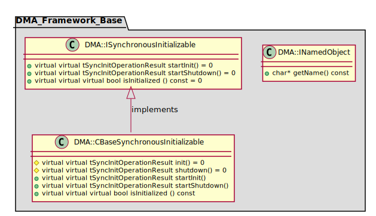
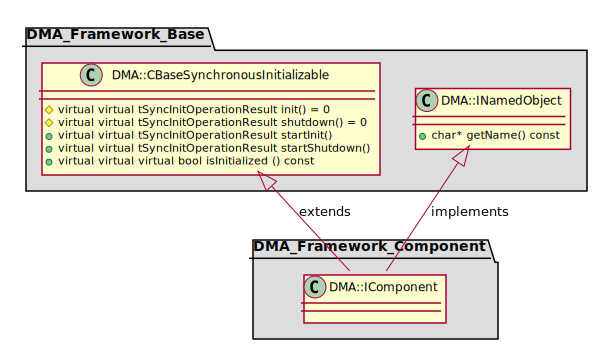
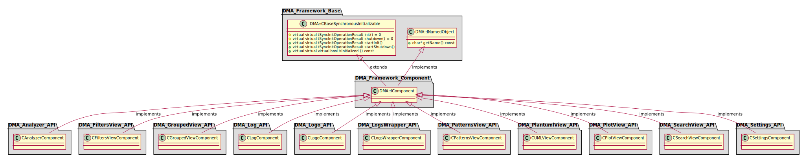

[**Go to the previous page**](./dev_docs.md)

----

# DMA

----

## DMA_Base

### Standalone package diagram

### Package diagram with the first-level dependencies

----

## DMA_Component

### Standalone package diagram

### Package diagram with the first-level dependencies

----

[**Go to the previous page**](./dev_docs.md)