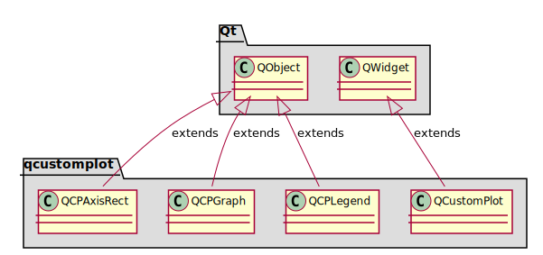
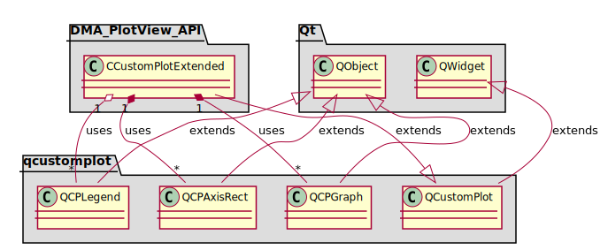

[**Go to the previous page**](./dev_docs.md)

----

# QCustomPlot

## Standalone package diagram

## Package diagram with the first-level dependencies

----

[**Go to the previous page**](./dev_docs.md)