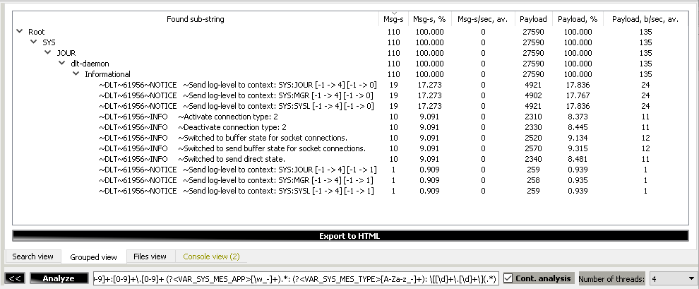
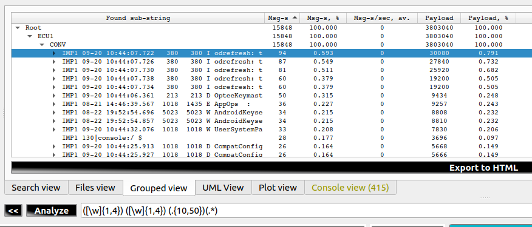
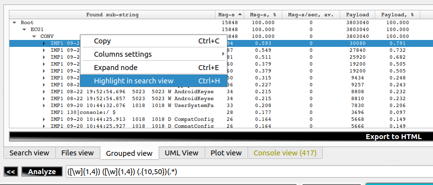
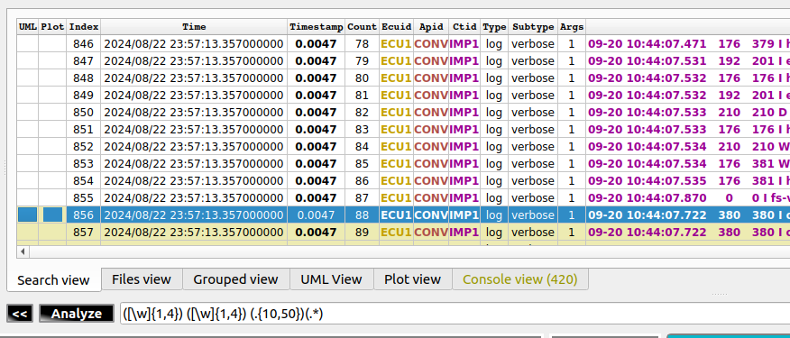
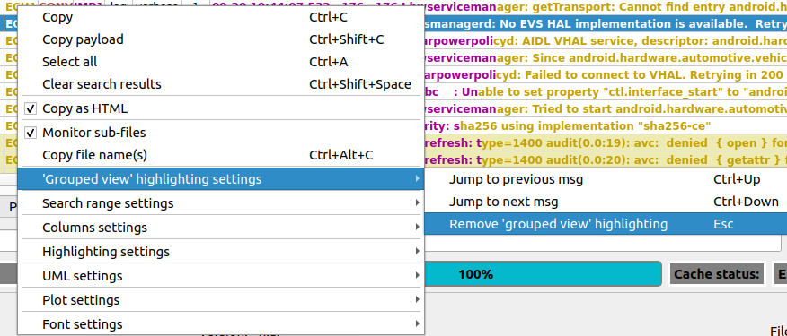
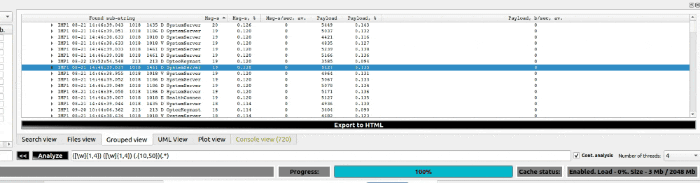
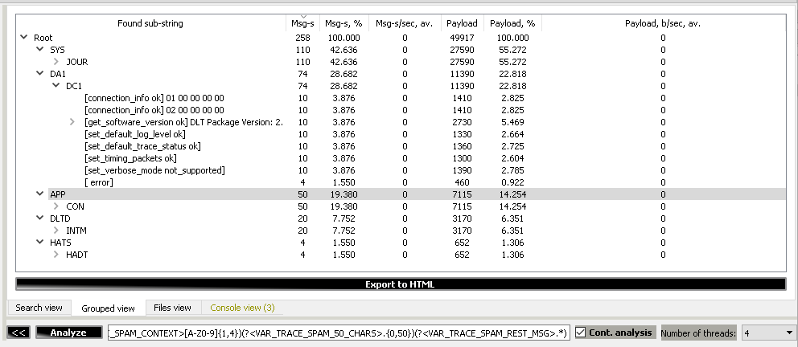

[**Go to the previous page**](../../README.md)

----

- [Grouped view](#grouped-view)
- [What does it look like?](#what-does-it-look-like)
- [Backward compatibility note](#backward-compatibility-note)
- [How does it work?](#how-does-it-work)
- [Groups nesting ordering](#groups-nesting-ordering)
- [Highlighting the group in the search view](#highlighting-the-group-in-the-search-view)
- [Trace spam use-case](#trace-spam-use-case)

----

# Grouped view

The "grouped view" intends to allow splitting messages into groups based on the "regex groups" syntax. Those groups are then represented in the tree view.

The view provides the following information regarding each tree level:
- number of messages, entries
- number of messages, percent
- number of messages, the average per second
- payload size, bytes
- payload size, percent
- payload size, the average per second

# What does it look like?



**Note!** As the presented example is based on the data imported from the non-dlt format, the columns 'Msg-s/sec, av.' and 'Payload, b/sec, av.' will not be filled in. When the data is received directly from the dlt-daemon, this part should work as expected.

# Backward compatibility note

**Important note!** Starting from version 1.0.30 of the DLT-Message-Analyzer plugin, the addition of the "?&lt;GV&gt;" regex group name makes the data appear in the grouped view. Before this version, data was added to the 'grouped view' by default for any regular expression group, which increased RAM consumption. To prevent this, the 'you shouldn't pay for what you are not using' principle was applied.

# How does it work?

The above screenshot contains an example of a "grouped view" of the Android boot messages.

Used regex is:

<pre>(?&lt;GV&gt;\w) (?&lt;GV&gt;[\w]+)\s+: (?&lt;GV&gt;.*)</pre>

The 'grouped view' will form the following set of the tree-view groups:

- (?&lt;GV&gt;\w) - a group for the specific message types - I, E, W, etc.
- (?&lt;GV&gt;[\w]+) - sub-group for application names - e.g., init, linker, libc, etc.
- (?&lt;GV&gt;.\*) - sub-group for payload of the message

You'll get the following result:

<pre>Root | Msg-s : 8802 | Msg-s, % : 100.000 | Msg-s/sec, av. : 0 | Payload : 2143141 | Payload, % : 100.000 | Payload, b/sec, av. : 0
|-W | Msg-s : 1316 | Msg-s, % : 14.951 | Msg-s/sec, av. : 0 | Payload : 290335 | Payload, % : 13.547 | Payload, b/sec, av. : 0
  |-linker | Msg-s : 2 | Msg-s, % : 0.023 | Msg-s/sec, av. : 0 | Payload : 496 | Payload, % : 0.023 | Payload, b/sec, av. : 0
    |-Warning: failed to find generated linker configuration from "/linkerconfig/ld.config.txt" | Msg-s : 2 | Msg-s, % : 0.023 | Msg-s/sec, av. : 0 | Payload : 496 | Payload, % : 0.023 | Payload, b/sec, av. : 0
  |-auditd | Msg-s : 2 | Msg-s, % : 0.023 | Msg-s/sec, av. : 0 | Payload : 453 | Payload, % : 0.021 | Payload, b/sec, av. : 0
    |-type=2000 audit(0.0:1): state=initialized audit_enabled=0 res=1 | Msg-s : 1 | Msg-s, % : 0.011 | Msg-s/sec, av. : 0 | Payload : 222 | Payload, % : 0.010 | Payload, b/sec, av. : 0
    |-type=1403 audit(0.0:2): auid=4294967295 ses=4294967295 lsm=selinux res=1 | Msg-s : 1 | Msg-s, % : 0.011 | Msg-s/sec, av. : 0 | Payload : 231 | Payload, % : 0.011 | Payload, b/sec, av. : 0
  |-printk | Msg-s : 5 | Msg-s, % : 0.057 | Msg-s/sec, av. : 0 | Payload : 1063 | Payload, % : 0.050 | Payload, b/sec, av. : 0
    |-init: 19 output lines suppressed due to ratelimiting | Msg-s : 1 | Msg-s, % : 0.011 | Msg-s/sec, av. : 0 | Payload : 211 | Payload, % : 0.010 | Payload, b/sec, av. : 0
    |-init: 5 output lines suppressed due to ratelimiting | Msg-s : 1 | Msg-s, % : 0.011 | Msg-s/sec, av. : 0 | Payload : 210 | Payload, % : 0.010 | Payload, b/sec, av. : 0
    |-apexd: 43 output lines suppressed due to ratelimiting | Msg-s : 1 | Msg-s, % : 0.011 | Msg-s/sec, av. : 0 | Payload : 212 | Payload, % : 0.010 | Payload, b/sec, av. : 0
    |-bpfloader: 595 output lines suppressed due to ratelimiting | Msg-s : 1 | Msg-s, % : 0.011 | Msg-s/sec, av. : 0 | Payload : 217 | Payload, % : 0.010 | Payload, b/sec, av. : 0
    |-apexd: 116 output lines suppressed due to ratelimiting | Msg-s : 1 | Msg-s, % : 0.011 | Msg-s/sec, av. : 0 | Payload : 213 | Payload, % : 0.010 | Payload, b/sec, av. : 0
  |-init | Msg-s : 2 | Msg-s, % : 0.023 | Msg-s/sec, av. : 0 | Payload : 443 | Payload, % : 0.021 | Payload, b/sec, av. : 0
    |-DM_DEV_STATUS failed for system_ext_a: No such device or address | Msg-s : 1 | Msg-s, % : 0.011 | Msg-s/sec, av. : 0 | Payload : 223 | Payload, % : 0.010 | Payload, b/sec, av. : 0
    |-DM_DEV_STATUS failed for product_a: No such device or address | Msg-s : 1 | Msg-s, % : 0.011 | Msg-s/sec, av. : 0 | Payload : 220 | Payload, % : 0.010 | Payload, b/sec, av. : 0
  |-libc | Msg-s : 38 | Msg-s, % : 0.432 | Msg-s/sec, av. : 0 | Payload : 10452 | Payload, % : 0.488 | Payload, b/sec, av. : 0
    |-Unable to set property "ctl.interface_start" to "android.hardware.automotive.vehicle@2.0::IVehicle/default": error code: 0x20 | Msg-s : 28 | Msg-s, % : 0.318 | Msg-s/sec, av. : 0 | Payload : 7952 | Payload, % : 0.371 | Payload, b/sec, av. : 0
    |-Unable to set property "ctl.interface_start" to "aidl/SurfaceFlingerAIDL": error code: 0x20 | Msg-s : 10 | Msg-s, % : 0.114 | Msg-s/sec, av. : 0 | Payload : 2500 | Payload, % : 0.117 | Payload, b/sec, av. : 0
  |-vspm | Msg-s : 1 | Msg-s, % : 0.011 | Msg-s/sec, av. : 0 | Payload : 200 | Payload, % : 0.009 | Payload, b/sec, av. : 0
    |-loading out-of-tree module taints kernel. | Msg-s : 1 | Msg-s, % : 0.011 | Msg-s/sec, av. : 0 | Payload : 200 | Payload, % : 0.009 | Payload, b/sec, av. : 0
  |-healthd | Msg-s : 2 | Msg-s, % : 0.023 | Msg-s/sec, av. : 0 | Payload : 359 | Payload, % : 0.017 | Payload, b/sec, av. : 0
    |-No battery devices found | Msg-s : 1 | Msg-s, % : 0.011 | Msg-s/sec, av. : 0 | Payload : 183 | Payload, % : 0.009 | Payload, b/sec, av. : 0
    |-battery none chg= | Msg-s : 1 | Msg-s, % : 0.011 | Msg-s/sec, av. : 0 | Payload : 176 | Payload, % : 0.008 | Payload, b/sec, av. : 0
... and so on ...
</pre>
 
The tested file was relatively small, containing some Android boot messages. Still, even in that data set, we can easily get a summary regarding which services have faced errors:

<pre>|-E | Msg-s : 295 | Msg-s, % : 3.352 | Msg-s/sec, av. : 0 | Payload : 71429 | Payload, % : 3.333 | Payload, b/sec, av. : 0
  |-resolv | Msg-s : 235 | Msg-s, % : 2.670 | Msg-s/sec, av. : 0 | Payload : 57340 | Payload, % : 2.676 | Payload, b/sec, av. : 0
  |-TAG | Msg-s : 19 | Msg-s, % : 0.216 | Msg-s/sec, av. : 0 | Payload : 4546 | Payload, % : 0.212 | Payload, b/sec, av. : 0
  |-PVR_K | Msg-s : 8 | Msg-s, % : 0.091 | Msg-s/sec, av. : 0 | Payload : 1666 | Payload, % : 0.078 | Payload, b/sec, av. : 0
  |-init | Msg-s : 8 | Msg-s, % : 0.091 | Msg-s/sec, av. : 0 | Payload : 2081 | Payload, % : 0.097 | Payload, b/sec, av. : 0
  |-TcUtils | Msg-s : 7 | Msg-s, % : 0.080 | Msg-s/sec, av. : 0 | Payload : 1365 | Payload, % : 0.064 | Payload, b/sec, av. : 0
  |-EpamIFA | Msg-s : 6 | Msg-s, % : 0.068 | Msg-s/sec, av. : 0 | Payload : 1800 | Payload, % : 0.084 | Payload, b/sec, av. : 0
  |-DEBUG | Msg-s : 5 | Msg-s, % : 0.057 | Msg-s/sec, av. : 0 | Payload : 1037 | Payload, % : 0.048 | Payload, b/sec, av. : 0
  |-vold | Msg-s : 2 | Msg-s, % : 0.023 | Msg-s/sec, av. : 0 | Payload : 458 | Payload, % : 0.021 | Payload, b/sec, av. : 0
  |-incfs | Msg-s : 2 | Msg-s, % : 0.023 | Msg-s/sec, av. : 0 | Payload : 496 | Payload, % : 0.023 | Payload, b/sec, av. : 0
  |-GpuMem | Msg-s : 1 | Msg-s, % : 0.011 | Msg-s/sec, av. : 0 | Payload : 254 | Payload, % : 0.012 | Payload, b/sec, av. : 0
  |-Build | Msg-s : 1 | Msg-s, % : 0.011 | Msg-s/sec, av. : 0 | Payload : 200 | Payload, % : 0.009 | Payload, b/sec, av. : 0
  |-cgroup | Msg-s : 1 | Msg-s, % : 0.011 | Msg-s/sec, av. : 0 | Payload : 186 | Payload, % : 0.009 | Payload, b/sec, av. : 0
</pre>

Together with that, you can see which kind of message has taken which amount of payload. That is quite important if you work within a system that has trace spam cases that should be addressed. 

----

# Groups nesting ordering

The plugin supports specifying the order of the groups added to the "grouped view."

Let's change our previous example from:

```
Message Type -> Application -> Payload
```

To:

```
Application -> Message Type -> Payload
```

You can achieve this by changing the regular expression to the following one:

<pre> (?&lt;GV_1&gt;\w) (?&lt;GV_0&gt;[\w]+)\s+: (?&lt;GV_2&gt;.*)</pre>

The index after the "GV_" prefix is used to specify the group nesting order.

You'll get the following result:

<pre>|-libc | Msg-s : 44 | Msg-s, % : 0.500 | Msg-s/sec, av. : 0 | Payload : 11779 | Payload, % : 0.550 | Payload, b/sec, av. : 0
  |-W | Msg-s : 38 | Msg-s, % : 0.432 | Msg-s/sec, av. : 0 | Payload : 10452 | Payload, % : 0.488 | Payload, b/sec, av. : 0
    |-Unable to set property "ctl.interface_start" to "android.hardware.automotive.vehicle@2.0::IVehicle/default": error code: 0x20 | Msg-s : 28 | Msg-s, % : 0.318 | Msg-s/sec, av. : 0 | Payload : 7952 | Payload, % : 0.371 | Payload, b/sec, av. : 0
    |-Unable to set property "ctl.interface_start" to "aidl/SurfaceFlingerAIDL": error code: 0x20 | Msg-s : 10 | Msg-s, % : 0.114 | Msg-s/sec, av. : 0 | Payload : 2500 | Payload, % : 0.117 | Payload, b/sec, av. : 0
  |-I | Msg-s : 5 | Msg-s, % : 0.057 | Msg-s/sec, av. : 0 | Payload : 1066 | Payload, % : 0.050 | Payload, b/sec, av. : 0
    |-malloc_limit: Allocation limit enabled, max size 134217728 bytes | Msg-s : 1 | Msg-s, % : 0.011 | Msg-s/sec, av. : 0 | Payload : 223 | Payload, % : 0.010 | Payload, b/sec, av. : 0
    |-malloc_limit: Allocation limit enabled, max size 536870912 bytes | Msg-s : 1 | Msg-s, % : 0.011 | Msg-s/sec, av. : 0 | Payload : 223 | Payload, % : 0.010 | Payload, b/sec, av. : 0
    |-malloc_limit: Allocation limit enabled, max size 1204464020 bytes | Msg-s : 1 | Msg-s, % : 0.011 | Msg-s/sec, av. : 0 | Payload : 224 | Payload, % : 0.010 | Payload, b/sec, av. : 0
    |-SetHeapTaggingLevel: tag level set to 0 | Msg-s : 2 | Msg-s, % : 0.023 | Msg-s/sec, av. : 0 | Payload : 396 | Payload, % : 0.018 | Payload, b/sec, av. : 0
  |-F | Msg-s : 1 | Msg-s, % : 0.011 | Msg-s/sec, av. : 0 | Payload : 261 | Payload, % : 0.012 | Payload, b/sec, av. : 0
    |-Fatal signal 6 (SIGABRT), code -1 (SI_QUEUE) in tid 3155 (bt_stack_manage), pid 2868 (droid.bluetooth) | Msg-s : 1 | Msg-s, % : 0.011 | Msg-s/sec, av. : 0 | Payload : 261 | Payload, % : 0.012 | Payload, b/sec, av. : 0
... and so on ...
</pre>

You can mix "GV" and "GV_&lt;IDX&gt;" regular group expression names. In this case, the "GV" will be nested in the order of occurrence but with less priority than those with the specified indices.

For example, we could achieve the same result even with the following regex:

<pre> (?&lt;GV&gt;\w) (?&lt;GV_0&gt;[\w]+)\s+: (?&lt;GV&gt;.*)</pre>

The application would be at the beginning due to the '0' index. All other "GV" groups would be located in the order of occurrence after the group with the index '0'.

----

# Highlighting the group in the search view

This Feature allows you to select a found group in the 'grouped view' and highlight all messages that it represents in the 'search view'.

1. Select one item from the grouped view. It can be a node at any level of the tree.
  
2. Press Ctrl+H or open the context menu and select the 'Highlight in search view' option.
  
3. The plugin will jump to the 'Search view' tab, and the table will scroll to the first message from the selected group. You will see that the background of all impacted messages is changed.
  
4. Use Ctrl+ArrowDown and Ctrl+ArrowUp to switch between the highlighted messages. Or use the corresponding context menu items.
  
5. Use the Esc button or the corresponding context menu item to turn off the highlighting of the selected group.
  
6. The Feature in action:
  
----

# Trace spam use-case

What does it look like?



Used regex is:

<pre>^(?&lt;GV_AND_VAR_TRACE_SPAM_APP&gt;[A-Z0-9]{1,4}) (?&lt;GV_AND_VAR_TRACE_SPAM_CONTEXT&gt;[A-Z0-9]{1,4})(?&lt;GV_AND_VAR_TRACE_SPAM_50_CHARS&gt;.{0,50})(?&lt;GV_AND_VAR_TRACE_SPAM_REST_MSG&gt;.*)</pre>

The 'grouped view' will form the following set of the tree-view nodes:

- ^(?&lt;GV_AND_VAR_TRACE_SPAM_APP&gt;[A-Z0-9]{1,4}) - group for ANY dlt app-id
- (?&lt;GV_AND_VAR_TRACE_SPAM_CONTEXT&gt;[A-Z0-9]{1,4}) - sub-group for ANY dlt context
- (?&lt;GV_AND_VAR_TRACE_SPAM_50_CHARS&gt;.{0,50}) - sub-group for first 50 characters of ANY message
- (?&lt;GV_AND_VAR_TRACE_SPAM_REST_MSG&gt;.\*) - sub-group for rest of the message

The result will be something like this:

<pre>Root | Msg-s : 258 | Msg-s, % : 100.000 | Msg-s/sec, av. : 0 | Payload : 49917 | Payload, % : 100.000 | Payload, b/sec, av. : 0
|-SYS | Msg-s : 110 | Msg-s, % : 42.636 | Msg-s/sec, av. : 0 | Payload : 27590 | Payload, % : 55.272 | Payload, b/sec, av. : 0
  |-JOUR | Msg-s : 110 | Msg-s, % : 42.636 | Msg-s/sec, av. : 0 | Payload : 27590 | Payload, % : 55.272 | Payload, b/sec, av. : 0
|-DA1 | Msg-s : 74 | Msg-s, % : 28.682 | Msg-s/sec, av. : 0 | Payload : 11390 | Payload, % : 22.818 | Payload, b/sec, av. : 0
  |-DC1 | Msg-s : 74 | Msg-s, % : 28.682 | Msg-s/sec, av. : 0 | Payload : 11390 | Payload, % : 22.818 | Payload, b/sec, av. : 0
    |- [connection_info ok] 01 00 00 00 00 | Msg-s : 10 | Msg-s, % : 3.876 | Msg-s/sec, av. : 0 | Payload : 1410 | Payload, % : 2.825 | Payload, b/sec, av. : 0
    |- [connection_info ok] 02 00 00 00 00 | Msg-s : 10 | Msg-s, % : 3.876 | Msg-s/sec, av. : 0 | Payload : 1410 | Payload, % : 2.825 | Payload, b/sec, av. : 0
    |- [get_software_version ok] DLT Package Version: 2. | Msg-s : 10 | Msg-s, % : 3.876 | Msg-s/sec, av. : 0 | Payload : 2730 | Payload, % : 5.469 | Payload, b/sec, av. : 0
    |- [set_default_log_level ok]  | Msg-s : 10 | Msg-s, % : 3.876 | Msg-s/sec, av. : 0 | Payload : 1330 | Payload, % : 2.664 | Payload, b/sec, av. : 0
    |- [set_default_trace_status ok]  | Msg-s : 10 | Msg-s, % : 3.876 | Msg-s/sec, av. : 0 | Payload : 1360 | Payload, % : 2.725 | Payload, b/sec, av. : 0
    |- [set_timing_packets ok]  | Msg-s : 10 | Msg-s, % : 3.876 | Msg-s/sec, av. : 0 | Payload : 1300 | Payload, % : 2.604 | Payload, b/sec, av. : 0
    |- [set_verbose_mode not_supported]  | Msg-s : 10 | Msg-s, % : 3.876 | Msg-s/sec, av. : 0 | Payload : 1390 | Payload, % : 2.785 | Payload, b/sec, av. : 0
    |- [ error]  | Msg-s : 4 | Msg-s, % : 1.550 | Msg-s/sec, av. : 0 | Payload : 460 | Payload, % : 0.922 | Payload, b/sec, av. : 0
|-APP | Msg-s : 50 | Msg-s, % : 19.380 | Msg-s/sec, av. : 0 | Payload : 7115 | Payload, % : 14.254 | Payload, b/sec, av. : 0
  |-CON | Msg-s : 50 | Msg-s, % : 19.380 | Msg-s/sec, av. : 0 | Payload : 7115 | Payload, % : 14.254 | Payload, b/sec, av. : 0
|-DLTD | Msg-s : 20 | Msg-s, % : 7.752 | Msg-s/sec, av. : 0 | Payload : 3170 | Payload, % : 6.351 | Payload, b/sec, av. : 0
|-HATS | Msg-s : 4 | Msg-s, % : 1.550 | Msg-s/sec, av. : 0 | Payload : 652 | Payload, % : 1.306 | Payload, b/sec, av. : 0
  |-HADT | Msg-s : 4 | Msg-s, % : 1.550 | Msg-s/sec, av. : 0 | Payload : 652 | Payload, % : 1.306 | Payload, b/sec, av. : 0</pre>
  
[**Go to the previous page**](../../README.md)