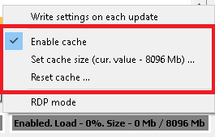

# In-RAM cache

----

DLTMessageAnalyzer plugin supports the "in-RAM cache", which actually means, that user is able to pre-cache the whole analyzed file or its part within the RAM, in order to achieve faster search.
By default, DLT-viewer access the storage ( HDD, SSD ) to read out each message during each search.
That is quite slow if we will compare it to "search within the RAM".
Observed boost even on SSD is ~3-5 times.
On HDD it is ~10 times and more.

Cache has the lazy initialization phase, so it will be initialized during indexing of the DLT file, or during the first search procedure.
In case if file size is bigger than the specified cache limit, only a part of file will be pre-cached. Other part will be accessed from the storage.

----

GUI part which describes the status of the cache looks like this:

It shows:
- whether cache is enabled?
- what is the cache size?
- what is the used cache in percent?
- what is the used cache part in megabytes?

----

The "in-RAM cache" related settings are located within the following context menu:

It allows to:
- Disable or enable cache
- Set cache size
- Reset the cache

----

**Note!** Actual RAM consumption of the cache is ~X*2.5 from what the status is showing.
The thing is that the cache size in status is measured as the sum of payloads and headers of all the messages, while the cache itself is stored in a slightly different way.
It is one of the TODO-s to minimize this difference.

----

**Useful hint!** In case if you are analyzing the huge DLT file, e.g. 10 Gb, it is quite useful to:
- turn off the cache
- use search within the cache at least once to find the range of time in which you are interested
- lock the search range to the target area
- turn on the cache
In such way you won't get the "lack of the RAM" use-case, while using the cache.

----

**Note!** Currently plugin does not check the provided cache limit against the actual amount of RAM on the client's machine.
Thus, try to provide the valid input data!

----

Extensive custom highlighting & grouping might slow down the search a little bit.
That impact is observed due to a run-time calculations and sorting.
Still, even in worst cases processing is done much faster than in usual dlt-viewer's search functionality. 
