[**Go to the previous page**](../../README.md)

----

Table of contents

- [Installation guide](#installation-guide)
  - [Clone repositories](#clone-repositories)
  - [Linux console build](#linux-console-build)
  - [Qt Creator build](#qt-creator-build)
    - [Qt Creator IDE set up](#qt-creator-ide-set-up)
    - [qmake *.pro based build](#qmake-pro-based-build)
    - [Linux and Windows QT creator build](#linux-and-windows-qt-creator-build)
  - [Run dlt-viewer and enable the plugin](#run-dlt-viewer-and-enable-the-plugin)
  - [Build dependencies and settings](#build-dependencies-and-settings)
    - [Build dependencies](#build-dependencies)
    - [Build settings](#build-settings)
  - [dlt-viewer-docker](#dlt-viewer-docker)
  - [Troubleshooting](#troubleshooting)
    - [CMake 3.28.1](#cmake-3281)

----

# Installation guide

## Clone repositories

- Clone the dlt-viewer project from the **[following location]( https://github.com/GENIVI/dlt-viewer )**.

> git clone git@github.com:GENIVI/dlt-viewer.git

----

> **Note!**
> 
> Currently plugin can be built against the v2.25.0 release.
>
> The build under the earlier versions, down to the the v2.19.0 is also supported. But you will need to use the compatibility mode. Such an option is described below later on down this page. Search for the "PLUGIN_INTERFACE_VERSION" keyword.
>
> Make sure, that you've checked out the compatible base-line and used required build options. 

----

- Clone DLT-Message-Analyzer's git repository ( the one which you are observing right now ) as a nested one inside the **"./dlt-viewer/plugin"** location.
Your target path to the plugin should look like **"./dlt-viewer/plugin/DLT-Message-Analyzer"**:

>```
> cd ./dlt-viewer/plugin
> git clone git@github.com:svlad-90/DLT-Message-Analyzer.git
> ```

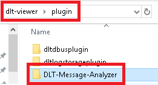

----

- modify also the **"./dlt-viewer/plugin/CMakeLists.txt"**:

<pre>add_subdirectory(DLT-Message-Analyzer/dltmessageanalyzerplugin/src)</pre>

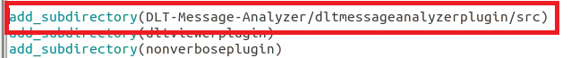

----

### Linux console build

- Open console in the "./dlt-viewer" folder:

  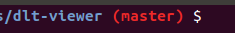

- Run the following set of commands in it:

  <pre># Install the 'libqt5svg5-dev' or 'libqt6svg6-dev' dependency
  sudo DEBIAN_FRONTEND=noninteractive apt-get -yq install libqt5svg5-dev
  # create build directory
  mkdir build
  # Enter the build directory
  cd build
  # Run cmake
  cmake ..
  # Build the project
  make -j4
  # Install dlt-viewer into the system
  sudo make install .
  # update the cache for the linker
  sudo ldconfig
  </pre>

- Then you can run the dlt-viewer from the following location:

  ```
  /usr/local/DLTViewer/usr/bin/dlt-viewer
  ```

----

## Qt Creator build

----

#### Qt Creator IDE set up

- Specify the location of CMake in QT Creator:

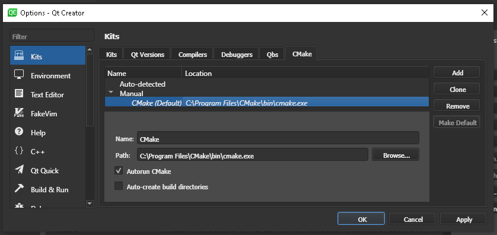

Afterward, open the dlt-viewer's CMake project, which is located in the root of the dlt-viewer repo:

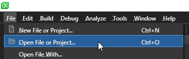

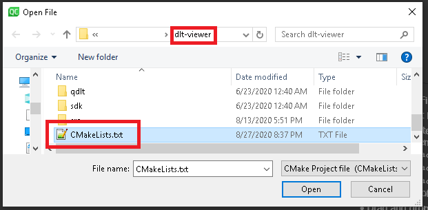

----

> **Important note for Linux compilation!**
>
> On Linux the compilation might fail, if you do not have installed uuid-dev package.
> That one is used by antlr, which is used by the DLT-Message-Analyzer.
> 
> Thus, please, install it before making attempt to build the project:
> sudo DEBIAN_FRONTEND=noninteractive apt-get -yq install uuid-dev

----

> **Important note!**
>
> Compilation might fail, if you do not have installed libqt5svg5-dev ( for Qt5 ) or libqt6svg6-dev ( for Qt6 ).
> Those are used by the QCustomPlot dependency, which is used by the DLT-Message-Analyzer.
>
> Thus, please, install it before making attempt to build the project:
> sudo DEBIAN_FRONTEND=noninteractive apt-get -yq install libqt5svg5-dev ( or libqt6svg6-dev )

----

### qmake *.pro based build

Such a build option was dropped.
DLT-Message-Analyzer has started to use antlr generator, which has only CMake support.
Thus the decision was finally made to support ONLY CMake builds for all supported platforms.
As of now, they are Linux and Windows.

----

### Linux and Windows QT creator build

- Select build type:

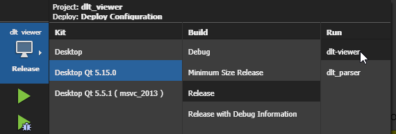

- Clear CMake configuration:

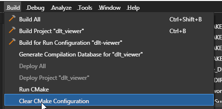

- Run CMake:

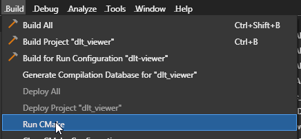

- Press build button:


----

## Run dlt-viewer and enable the plugin

- Run the dlt-viewer. It should already include and load the dynamic library of the DLT-Message-Analyzer plugin
- Enable and show the DLT-Message-Analyzer plugin:

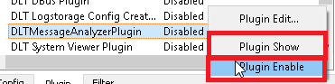

----

## Build dependencies and settings

### Build dependencies

> **Note!** 
> 
> For Linux build you will need to install the uuid-dev package. 
> It is required to build the antlr4 runtime library.
> To do that you can use the following commands:
>
> ```
> sudo apt update
> sudo apt-get install uuid-dev
> ```
>

----

> **Note!** 
> 
> If you want to have a compatible build with PLUGIN_INTERFACE_VERSION "1.0.0", enable the following define in the 
> **./dlt-viewer/plugin/ DLT-Message-Analyzer/ dltmessageanalyzerplugin/ src/ CMakeLists.txt**:
> 
> 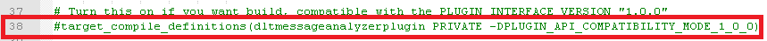

----

> **Note!** 
> 
> To run dlt-viewer and DLT_Message-Analyzer, which are built with msvc, you will need to install the corresponding version of the Visual C++ Redistributable package.
> 
> Here is a link, by which you can find such packages for 2015, 2017, 2019 versions of the msvc - https://support.microsoft.com/en-us/help/2977003/the-latest-supported-visual-c-downloads
>
> In case if the link will become irrelevant, just google for the "Visual C++ Redistributable package" keyword in your browser.
> 

----

### Build settings

> **Note!** 
> 
> If build fails due to missing qt5serialport5 package, perform the following commands:
>```
> sudo apt-get install libqt5serialport5
> sudo apt-get install libqt5serialport5-dev
>```
> For Qt6 [__qtserialport__](https://doc.qt.io/qt-6/qtserialport-index.html) module needs to be installed.

----

## dlt-viewer-docker

[sevketcaba](https://github.com/sevketcaba) has developed a useful tool, which allows to build and run dlt-viewer + DMA inside the Docker container. The approach is based on *.sh scripts, so it can be used only for Linux.

The usage is quite simple:

- Clone [this repository](https://github.com/sevketcaba/dlt-viewer-docker)
- cd to qt5, or qt6, depending on which version of QT you want to use
- Run ./build.sh in order to build the Docker image
- Run ./run.sh in order to start the corresponding Docker container and start the dlt-viewer with preinstalled DMA

----

## Troubleshooting

### CMake 3.28.1

It was identified that with version 3.28.1 of the CMake tool, you will get the following error during the DLT Message Analyzer build:

> make[2]: *** No rule to make target 'plugin/DLT-Message-Analyzer/dltmessageanalyzerplugin/src/antlr4_runtime/src/antlr4_runtime/runtime/Cpp/dist/libantlr4-runtime.a', needed by 'plugin/DLT-Message-Analyzer/dltmessageanalyzerplugin/src/CMakeFiles/antlr4_PCRE_static_autogen_timestamp_deps'.  Stop. make[1]: *** [CMakeFiles/Makefile2:1716: plugin/DLT-Message-Analyzer/dltmessageanalyzerplugin/src/CMakeFiles/antlr4_PCRE_static_autogen_timestamp_deps.dir/all] Error 2 make: *** [Makefile:156: all] Error 2

It is likely caused by the bug in that specific version of CMake, combined with the old-style CMake scripting used by the Antlr4 C++ runtime.

As a reliable solution, please switch to the other CMake version. E.g., 3.22.1 and 3.29.6 worked just fine.

You can find more details regarding this issue [here](https://github.com/svlad-90/DLT-Message-Analyzer/issues/203).

----

[**Go to the previous page**](../../README.md)
