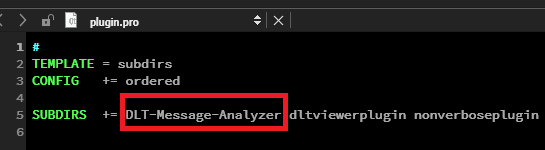
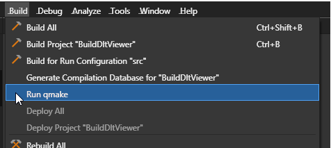

[**Go to the previous page**](../../README.md)

----

# Installation guide

- Clone the dlt-viewer project from the **[following location]( https://github.com/GENIVI/dlt-viewer )**.

----

> **Note!**
> 
> Currently plugin can be built against the v2.20.0 release. So, be sure, that you've checked out the correct base-line. 

----

- Follow instructions within the dlt-viewer's repo to have it successfully built.
- Clone DLT-Message-Analyzer's git repository ( the one which you are observing right now ) as a nested one inside the **"./dlt-viewer/plugin"** location.
Your target path to plugin should look like **"./dlt-viewer/plugin/DLT-Message-Analyzer"**:

----

## "QT Creator"-specific part of guide.

- Modify the **"./dlt-viewer/plugin.pro"** in the following way:
<pre>SUBDIRS += DLT-Message-Analyzer ... all other plugin's names, which exist in delivery by default ...</pre>

- Run qmake:

- Rebuild the dlt-viewer project: 

----

## CMake-specific part of guide

- In case if you build the project without the QT Creator, using only the CMakeLists.txt, modigy also the **"./dlt-viewer/plugin"**:

<pre>add_subdirectory(DLT-Message-Analyzer/dltmessageanalyzerplugin/src)</pre>

- Open console in the "./dlt-viewer" folder:

- Run the following set of commands in it:

<pre>mkdir build
cd ./build
rm -r *
cmake ../
make
</pre>

----

- Proceed to the build artifact's folder and run the dlt-viewer, including dynamic library of the DLT-Message-Analyzer plugin
- Enable and show the DLT-Message-Analyzer plugin:

----

[**Go to the previous page**](../../README.md)