[**Go to the previous page**](../../README.md)

----

# Integration with PlantUML

DLT-Message-Analyzer's implementation is integrated with the PlantUML tool ( https://plantuml.com/ )
PlantUML is used to generate different types of UML diagrams out of their textual descriptions.
This plugin is using the PlantUML syntax to generate sequence diagrams out of the logs.

----
> **Note!**
>
> For the majority of its features PlantUML is using Graphviz as its dependency.
> Still, for the creation of sequence diagrams, Graphviz is not used. Thus there is no need to install any additional SW on your PC.
> And plantuml.jar itself is distributed together with the plugin's source code.
> It will be automatically copied to the build directory as part of the CMake or QTCreator build. 
> 
> In other words - this feature should work out of the box.

> **Note!**
>
> Plugin allows the client to explicitly specify the path to the plantuml tool, in case if the default path is not suitable or, for any reason, it does not work.
> Search the "Plantuml settings" paragraph below on this page. 
----

----

## Motivation

As a SW developer or SW architect, I want to be able to automatically build sequence diagrams out of the output of the different applications within the system. 
I want to be able to normalize data from different applications and put them all into a single unified sequence diagram.

Why is that important?
- Instant synchronization between logs and sequence diagrams is required to achieve productive discussions with different stakeholders, which often do not have an idea regarding the format of logs of different applications.
- Often the task is to represent, which PART OF THE SEQUENCE is wrong and should be changed. Building a "correct" sequence based on the currently existing one is much faster than building a new sequence from scratch.
- Support of the project's documentation becomes much easier when you can get sequences out of the latest logs. 

----

## General idea

To turn on the PlantUML feature of the plugin, enable it in the general context-menu:

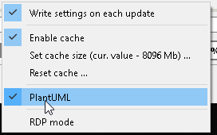

----
> **Note!**
>
> PlantUML feature is turned on by default
----

The idea of this feature is that the user can specify to the plugin, which parts of message mean what in terms of a sequence diagram.
A predefined set of the regex group names is used to identify different common parts of the sequence diagram.
UML regex group identifiers, which are supported by the plugin:

| Group name | Meaning | Type |
| ------------- | ------------- | ------------- |
| UCL | Name of the client | mandatory |
| US | Service name | mandatory |
| UM | Method name | mandatory |
| URT | Request identifier | request_type - at least one of the request types should be filled in |
| URS | Response identifier | request_type - at least one of the request types should be filled in |
| UEV | Event identifier | request_type - at least one of the request types should be filled in |
| UTS | Call timestamp | optional - if not specified, the dlt message timestamp is used |
| USID | Sequence id of the communication | optional |
| UA | Call arguments | optional |

----

----
> **Note!**
>
> You can get the same information if you will input the "UML-id" command into the debug console.
>
> 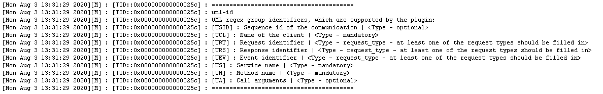
----

Result formatting within the generated plantuml file would look like this:
<pre>&lt;UCL&gt; &lt;URT|URS|UE&gt; &lt;US&gt; : [timestamp] &lt;USID&gt;&lt;UM&gt;(&lt;UA&gt;)</pre>

In case if provided regex will contain ALL mandatory fields, the plugin will consider them and will check each found message regarding whether it can be used for the creation of the sequence diagram.

----

## Simple example

Let's provide an example.
Imagine that we have the following 3 messages, which represent the communication between components "Alice" and "Bob":

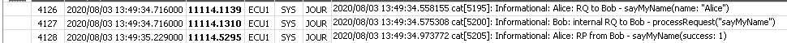

The above way of tracing is unified and contains all required parts to create a sequence out of it. 
We can use the following regex expression for creation of the sequence diagram:
<pre>^(SYS).*?: Informational: (?&lt;UCL&gt;[\w]+):.*?((?&lt;URT&gt;RQ)|(?&lt;URS&gt;RP)|(?&lt;UEV&gt;EV)).*?(to|from) (?&lt;US&gt;[\w]+) - (?&lt;UM&gt;.*?)\((?&lt;UA&gt;.*?)\)</pre>

The result of the search would look like:

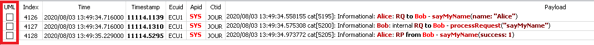

As you can see above, all found messages have active checkbox items in the "UML" column.
It means, that they can be used for diagram creation.
Let's select those rows:

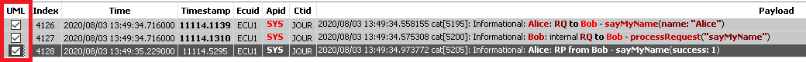

----
> **Note!**
>
> As you can see, all selected rows will be highlighted with the gray color. That is done to increase readability during work with UML capabilities.
> 
> It is possible to select multiple rows to be used for UML diagram creation via "Selecting multiple rows by mouse, and then pressing Space"
> 
> It is possible to select all rows to be used for UML diagram creation via "Input Ctrl+A, then pressing Space"
----

Now, let's switch to the "UML view" and trigger diagram creation:

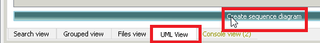

The resulting diagram looks like this:

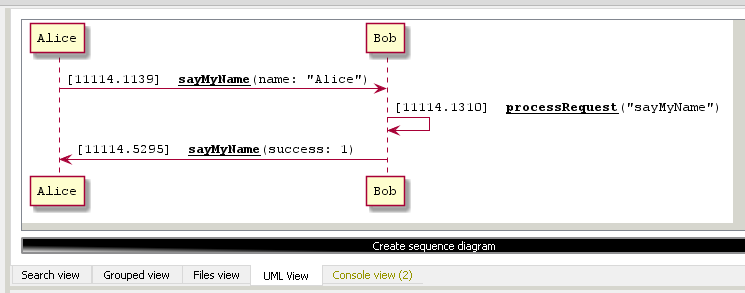

The resulting diagram can be saved as PNG, SVG, or PUML file.

Use the following context menu item to trigger save operation:

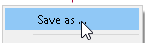

----

## Advanced example

The first example was quite simple, as the log has contained all the required parts.
But what if you need a sequence for a set of the messages, which does not contain all required elements? 
E.g. there is no service name, client name, or method name.

Still, as a developer, you might understand the context, and want to fulfill the missing parts and have a sequence without modification of logs.
Fortunately, the DLT-Message-Analyzer allows you to do this.

Imagine that we have the following 3 messages, which represent the communication between components "Alice" and "Bob":

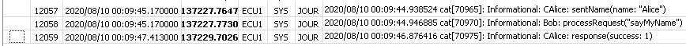

Let's also imagine that the resulting diagram should have actor Alex instead of actor Alice.
The above way of tracing is not quite unified and does not contain all required parts to create a sequence out of it. 
Also, it contains a typo - Alice instead of Alex.
Still, we can use the following regex expression for sequence creation:

<pre>^(SYS).*?: Informational: ((?&lt;UCL_Alex&gt;CAlice):.*?(?&lt;US_Bob&gt;(?&lt;UM_sayMyName&gt;(?&lt;URT&gt;sentName)|(?&lt;URS&gt;response))).*?\((?&lt;UA&gt;.*)\)|(?&lt;UCL_AND_US&gt;Bob): (?&lt;URT&gt;processRequest)\("(?&lt;UM&gt;[\w]+)"\))</pre>

Specific parts of behavior:

- UCL_Alex will replace CAlice to Alex in the diagram's content
- US_Bob will add Bob service, despite, that it is not presented in the message
- UM_sayMyName will add sayMyName method, despite that it is not presented in the message
- URT & URP are stick to the parts of the message, which only indirectly show whether it is a request or response
- UCL_AND_US will add Bob client and service, despite that it is not part of the message

The result of the search would look like:

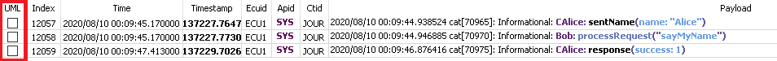

As you can see above, all found messages have active checkbox items in the "UML" column.
It means, that they can be used for diagram creation.
Let's select those rows:

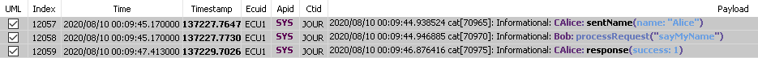

Now, let's switch to the "UML view" and trigger diagram creation:

The resulting diagram looks like this:

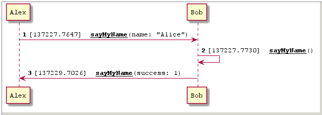

----
> **Note!**
>
> There is a possibility to combine multiple UML items in the name of one group. 
> E.g. US_AND_UCL, or US_Alex_AND_UCL_Alex.
>
> Still, there is no possibility to mention the same UML item type in the same group name more than once. 
> E.g. in the case of US_Alex_AND_US_Alice "last win" strategy is applied, meaning that US_Alice will win.
----

----
> **Note!**
>
> Imagine the case, when one UML type is specified in one regex more than once:
> <pre>(?&lt;UM_one&gt;[\w]+):(?&lt;UM__two&gt;[\w]+)</pre>
> In such a case, if one UML type will be found in a result log more than once, all found results of the same type will be concatenated. 
> With the above example result could be: "one_two".
----

----

## Plantuml text editor

----

Sometimes it is needed to slightly modify the resulting diagram, which you've obtained from the logs. E.g. to point out to the neighbor domain, which step of the sequence is wrong.

Or it might be needed to create your own diagram and instantly check it without sharing it with some external services. E.g. without the usage of google chrome's extensions, which do load your project-specific content to the external servers to convert *.puml to *.svg, *.png, etc. 

Plugin's implementation allows you to reach both approaches:

- You can either type in the text input field the custom diagram's content
- Or you can build a diagram out of the logs and then manually modify it. Content of "diagram from logs" will be placed inside the text editor on each creation. Then you can adjust its content as to your needs.

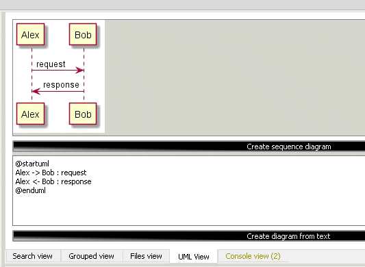

The additional bonus: in case if you have Graphviz installed, other types of diagrams are also supported, e.g. class diagrams:

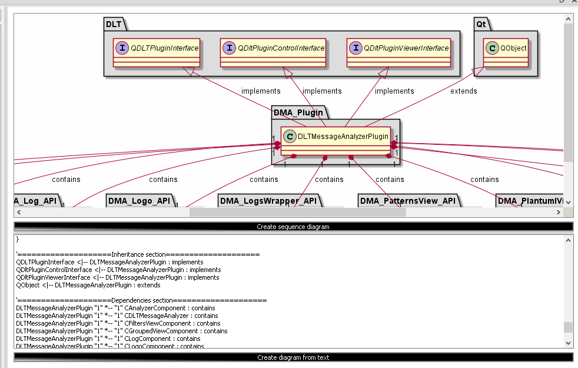

----

## Diagrams settings

----

### Autonumber

Plugin implementation supports the possibility to number the steps of the sequence diagram:

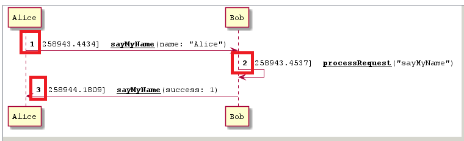

By default, numbering is turned on.
It is possible to turn it off using the corresponding context menu item:

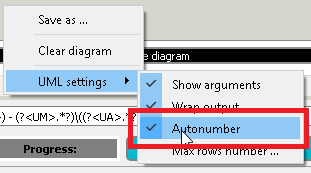

----

#### Maximum number of rows

Default maximum number of rows within the rendered diagram - 1000 rows. All rows which are above that number will be ignored. Anyway, this limit can be adjusted from within UI, if needed.

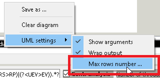

----

#### Other settings

By default, the call arguments are shown. Row description is wrapped every 200 symbols.
These parameters can be overwritten via the context menu:

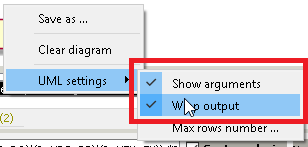

----

## Plantuml settings

----

There is a set of settings, which allows you to specify the location of the plantuml.jar on your machine:

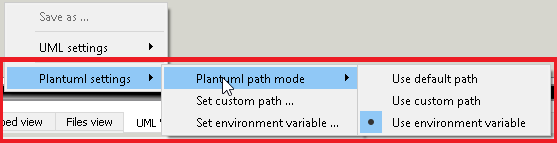

You can:
- Use default plantuml location - <dlt-viewer-folder>/plugins/plantuml.jar
- Specify the custom path to plantuml.jar
- Specify the name of the environment variable, which will contain the path to the plantuml tool

In order to visualize the current plantuml settings you can use the "plantuml-settings" command in the debug console:

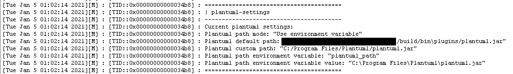

----

The same set of settings exists, which allows you to specify the location of the java on your machine:

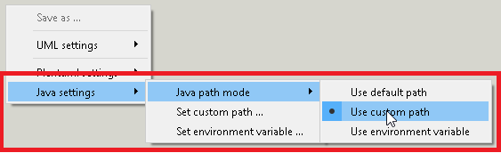

You can:
- Use default java location. In this case we will assume, that the compatible java version is speified on your path.
- Specify the custom path to java
- Specify the name of the environment variable, which will contain the path to the java

In order to visualize the current plantuml settings you can use the "java-settings" command in the debug console:

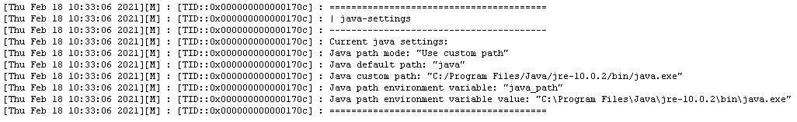

----

[**Go to the previous page**](../../README.md)