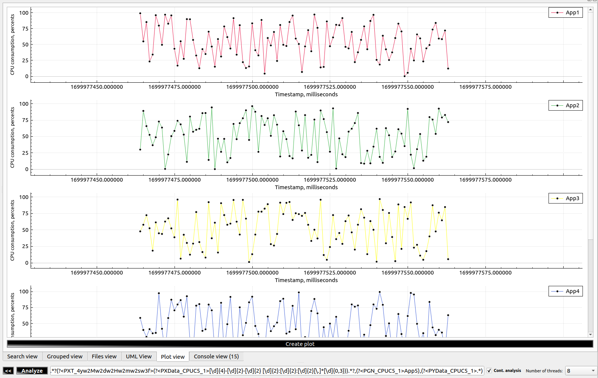
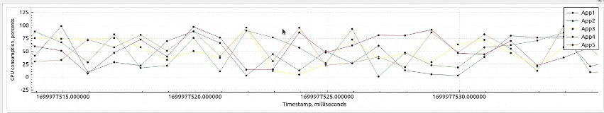

[**Go to the previous page**](../../README.md)

----

# Table of contents

- [Plot view](#plot-view)
   * [How it looks like?](#how-it-looks-like)
   * [Overview](#overview)
   * [Motivation](#motivation)
   * [General idea](#general-idea)
   * [Examples](#examples)
      + [Multiple graphs on one axis rectangle](#multiple-graphs-on-one-axis-rectangle)
      + [Graphs on multiple axis rectangles](#graphs-on-multiple-axis-rectangles)
   * [Expected workflow](#expected-workflow)
   * [Interactions with the plot](#interactions-with-the-plot)
      + [Select a point on the graph](#select-a-point-on-the-graph)
      + [Change the opacity](#change-the-opacity)
      + [Save the generated plot](#save-the-generated-plot)
      + [Horizontal drag](#horizontal-drag)
      + [Horizontal zoom](#horizontal-zoom)
      + [Vertical zoom and drag](#vertical-zoom-and-drag)
      + [Filtering the graph](#filtering-the-graph)
      + [Legend scrolling](#legend-scrolling)
   * [Gantt charts](#gantt-charts)

----

# Plot view

## How it looks like?

## Overview

DLT-Message-Analyzer's implementation is using the QCustomPlot library ( https://www.qcustomplot.com/ ) to generate plots out of the logs.

This feature allows you to place different metrics received from the logs into a composite chart. By X-axis of that chart by default you always have time. The dlt-viewer's timestamp is used. Timestamp values can also be received and decoded from the payload of the message. That is useful for imported traces.

The feautre supports the following types of the charts:

- Linear chart
- Point chart
- Gantt chart

----

## Motivation

As a SW developer or SW architect, I want to be able to automatically build complex plots out of the output of the different applications within the system. 
I want to be able to normalize data from different applications and put them all into a set of diagrams, which are showing different parameters of the system, still aligned by timestamps.

Why is that important?
- Instant synchronization between logs and plots is required to achieve productive discussions with different stakeholders, which often do not have an idea regarding the format of logs of different applications.
- Often, the task is to represent, which KPI is not fulfilled. Building a "correct" plot will speed up the things.
- Often, the task is to find a root cause of some issue. Visualization of several parameters in one plot can help with that. E.g. you can build chart of memory consumption + "out of memory" crash events and see whether there are memory leaks across the system.

----

## General idea

To turn on the plot view feature of the plugin, enable it in the general context-menu:

----
> **Note!**
>
> Plot view feature is turned on by default
----

The idea of this feature is that the user can specify to the plugin, which parts of message mean what in terms of a plot.
A predefined set of the regex group names is used to identify different common parts of the diagram.
Plot regex group identifiers, which are supported by the plugin:

|#| Group name | Format | Example | Meaning | Type |
| ------------- | ------------- | ------------- | ------------- | ------------- | ------------- |
|1| **PARType** | PARType + _ + \<axisRectName\> + _ + \<axisRectType\> | PARType_CPUC_LINEAR  |**Plot axis rectangle type**. Type of the specific plot axis rectangle. Supported types are - GANNT, POINT, LINEAR.|**Optional**. If not specified, the LINEAR value is used. If multiple values appear - the 'last win' strategy is applied.|
|2| **PARL** | PARL + _ + \<axisRectName\> + _ + \<axisRectLabel\> | PARL_CPUC_MyChart  |**Plot axis rectangle label**. The label, that will be created above the corresponding plot axis rectangle.|**Optional**. If not specified, the label is not created. If multiple values appear for the same 'axisRectName' - they are concatenated.|
|3| **PXMx** | PXMx + _ + \<axisRectName\> + _ + \<integer_part_value\> + _ + [real_part_value] + _ + [neg] | PXMx_CustomDiagram_10_00 | **Plot X Max**. Sets the maximum visible value on axis X of the specified axis rectangle. | **Optional**. Last win. If not set, then the maximum value will be derived from the provided data. You can omit 'real_part_value' if not needed. Use the 'neg' keyword as the last parameter to specify negative values. |
|4| **PXMn** | PXMn + _ + \<axisRectName\> + _ + \<integer_part_value\> + _ + [real_part_value] + _ + [neg] | PXMn_CustomDiagram_10_00_neg | **Plot X Min**. Sets the minimum visible value on axis X of the specified axis rectangle. | **Optional**. Last win. If not set, then the minimum value will be derived from the provided data. You can omit 'real_part_value' if not needed. Use the 'neg' keyword as the last parameter to specify negative values. |
|5| **PYMx** | PYMx + _ + \<axisRectName\> + _ + \<integer_part_value\> + _ + [real_part_value] + _ + [neg] | PYMx_CPUC_100_00 | **Plot Y Max**. Sets the maximum visible value on axis Y of the specified axis rectangle. | **Optional**. Last win. If not set, then the maximum value will be derived from the provided data. You can omit 'real_part_value' if not needed. Use the 'neg' keyword as the last parameter to specify negative values. |
|6| **PYMn** | PYMn + _ + \<axisRectName\> + _ + \<integer_part_value\> + _ + [real_part_value] + _ + [neg] | PYMn_CPUC_0_00 | **Plot Y Min**. Sets the minimum visible value on axis Y of the specified axis rectangle. | **Optional**. Last win. If not set, then the minimum value will be derived from the provided data. You can omit 'real_part_value' if not needed. Use the 'neg' keyword as the last parameter to specify negative values. |
|7| **PXN** | PXN + _ + \<axisRectName\> + _ + \<name\> | PXN_CPUC_Timestamp |**Plot X-axis name**. Sets plot X-axis name for the specified plot axis rectangle. Use camelStyleNaming. E.g. 'camelStyleNaming' will be represented as 'Camel style naming' inside the diagram. | **Optional**. If not set, the default 'Timestamp' value is used. |
|8| **PYN** | PYN + _ + \<axisRectName\> + _ + \<name\> | PYN_CPUC_CPUConsumption |**Plot Y-axis name**. Sets plot Y-axis name for the specified plot axis rectangle. Use camelStyleNaming. E.g. 'camelStyleNaming' will be represented as 'Camel style naming' inside the diagram. | **Optional**. If not set - remains empty. |
|9| **PXU** | PXU + _ + \<axisRectName\> + _ + \<unit\> | PXU_CPUC_Milliseconds | **Plot X-axis unit**. Specifies the plot X-axis unit. Use camelStyleNaming. E.g. 'camelStyleNaming' will be represented as 'Camel style naming' inside the diagram. | **Optional**. If not set, then the 'seconds' default value is used, as the X-axis is usually used to represent the time, and in dlt, the timestamp is measured in seconds ( with real part, representing milliseconds, microseconds, etc. ) |
|10| **PYU** | PYU + _ + \<axisRectName\> + _ + \<unit\> | PYU_CPUC_Percents | **Plot Y-axis unit**. Specifies the plot Y-axis unit. Use camelStyleNaming. E.g. 'camelStyleNaming' will be represented as 'Camel style naming' inside the diagram. | **Optional**. If not set - remains empty. |
|11| **PXData** | PXData + _ + \<axisRectName\> + _ + \<graphId\> + _ + [value] | PXData_CPUC_1 |**Plot X-axis data**. The content of this regex group contains the data, that will be placed at axis X of the specified graph id and axis rectangle. The data of EACH VALUE should be convertible from the string to the float or the date-time. For conversion to date-time see PXT parameter. The graphId parameter should be convertible to an integer. If an optional 'value' parameter was specified, the captured data would be ignored. The 'value' param will be NOT considered as the "time", even if the PXT data was provided. | **Optional**. If not set, the timestamp of each involved DLT message would be used. This parameter can be used for the Gantt chart to get the timestamp from the message's payload. |
|12| **PXT** | PXT + _ + \<timeFormat\> | PXT_4yw2Mv2dw2Hw2mw2sw6f | **Plot X-axis time format**. Specifies, how to decode the date and time from the string out of the PXData. E.g. the '05-24 18:25:01.439' time format can be decoded with PXT_2Mw2dw2Hw2mw2sw3f. y - year. M - month. d - day. H - hour. m - minute. s - second. w - any delimiter symbol. f - a real part of the second ( milliseconds, microseconds, etc. ). Useful for custom imported logs, like Android logcat traces, which do not have proper dlt timestamp. | **Optional**. If not specified - there would be no attempt to decode PXData as time. |
|13| **PYData** | PYData + _ + \<axisRectName\> + _ + \<graphId\> + _ + [value] | PYData_CPUC_1 |**Plot Y-axis data**. The content of this regex group contains the data, that will be placed at axis Y of the specified graph id and axis rectangle. The data of EACH VALUE should be convertible from the string to the float or the date-time. For conversion to date-time see PYT parameter. The graphId parameter should be convertible to an integer. If an optional 'value' parameter was specified, the captured data would be ignored. The 'value' param will be NOT considered as the "time", even if the PYT data was provided. | **Mandatory** for plots in which 'PARType' is not equal to 'GANTT'. Not applicable to Gantt charts. |
|14| **PYT** | PYT + _ + \<timeFormat\> | PYT_4yw2Mv2dw2Hw2mw2sw6f | **Plot Y-axis time format**. Specifies, how to decode the date and time from the string out of the PYData. E.g. the '05-24 18:25:01.439' time format can be decoded with PYT_2Mw2dw2Hw2mw2sw3f. y - year. M - month. d - day. H - hour. m - minute. s - second. w - any delimiter symbol. f - a real part of the second ( milliseconds, microseconds, etc. ). Useful for custom imported logs, like Android logcat traces, which do not have proper dlt timestamp. | **Optional**. If not specified - there would be no attempt to decode PYData as time. Not applicable to Gantt charts. |
|15| **PGN** | PGN + _ + \<axisRectName\> + _ + \<graphId\> + _ + [name] | PGN_CPUC_1_NavApp, PGN_CPUC_1 | **Plot graph name**. Specifies the graph name for the specified graph id. If name parameter is not specified, then graph names would be derrived from the caprute content, and a separate graph on the plot would be created for each unique captured graph name. If name parameter is specified, then all names of the specified graphId would be the hard-coded ones, and only one graph would be produced on the plot for that graph id. | **Mandatory** for plots in which 'PARType' is not equal to 'GANTT'. |
|16| **PGMD** | PGMD + _ + \<axisRectName\> + _ + \<graphId\> + _ + \<key\> + _ + [value] | PGMD_SST_1_Domain | **Plot graph meta data**. Declares a metadata item, which ( if found for a specific plot point ) will be added to point's representation when it is selected by the user. | Optional. One or more. If 'value' parameter is not explicitly set, then captured data will be set as 'value'. If multiple 'value'-s are found in the analyzed string for the same 'key' - they will be concatenated. That includes both captured and explicitly set 'value'-s. |
|17| **PGE** | PGE + _ + \<axisRectName\> + _ + \<graphId\> + _ + \<eventType\> | PGE_proc_1_start | **Plot Gantt chart event**. Declares event of a certain type ( either "start" or "end" ). Used to identify start and end points of different events, which should be represented on the Gantt chart. | Mandatory. One or more. Applicable only for Gantt charts. |
|18| **PGEID** | PGE + _ + \<axisRectName\> + _ + \<graphId\> | PGE_proc_1 | **Plot Gantt chart event identifier**. This parameter specifies an event identifier. If specified, the analysis process will connect each event type's start and end points ONLY if they have the same event identifier. Non-consistent events will be ignored, e.g., with start ID - 5, end ID - 8. | Optional. If multiple values appear - the 'last win' strategy is applied. Applicable only for Gantt charts. |

----

## Examples

### Multiple graphs on one axis rectangle

Use the following dlt [file](./cpu_load_plot_example.dlt). It contains generated data that emulates the CPU load messages of 5 applications.

Apply search with the following regex:

> <pre>(?&lt;PXU_CPUC_milliseconds&gt;(?&lt;PYU_CPUC_percents&gt;(?&lt;PARType_CPUC_LINEAR&gt;(?&lt;PXN_CPUC_Timestamp&gt;(?&lt;PYN_CPUC_CPUConsumption&gt; ))))).\*?(?&lt;PXT_4yw2Mw2dw2Hw2mw2sw3f&gt;(?&lt;PXData_CPUC_1&gt;[\d]{4}-[\d]{2}-[\d]{2} [\d]{2}:[\d]{2}:[\d]{2}[\.]\*[\d]{0,3})).\*?,(?&lt;PGN_CPUC_1&gt;(?&lt;PGMD_CPUC_1_AppName&gt;.\*?)),(?&lt;PYData_CPUC_1&gt;.\*)</pre>

You should see messages with the enabled 'Plot' checkbox:

Use Ctrl+A -> Space, to select all the checkboxes in the 'Plot' column.

Switch to the 'Plot view' tab and press the 'Create plot' button. You should see the created plot:

----

### Graphs on multiple axis rectangles

Use the same dlt [file](./cpu_load_plot_example.dlt).

Apply search with the following regex:

> <pre>(?&lt;PXU_CPUC1_milliseconds&gt;(?&lt;PYU_CPUC1_percents&gt;(?&lt;PARType_CPUC1_LINEAR&gt;(?&lt;PXN_CPUC1_Timestamp&gt;(?&lt;PYN_CPUC1_CPUConsumption&gt; ))))).*?(?&lt;PXT_4yw2Mw2dw2Hw2mw2sw3f&gt;(?&lt;PXData_CPUC1_1&gt;[\d]{4}-[\d]{2}-[\d]{2} [\d]{2}:[\d]{2}:[\d]{2}[\.]*[\d]{0,3})).*?,(?&lt;PGN_CPUC1_1&gt;(?&lt;PGMD_CPUC1_1_AppName&gt;App1)),(?&lt;PYData_CPUC1_1&gt;.*)|(?&lt;PXU_CPUC2_milliseconds&gt;(?&lt;PYU_CPUC2_percents&gt;(?&lt;PARType_CPUC2_LINEAR&gt;(?&lt;PXN_CPUC2_Timestamp&gt;(?&lt;PYN_CPUC2_CPUConsumption&gt; ))))).*?(?&lt;PXT_4yw2Mw2dw2Hw2mw2sw3f&gt;(?&lt;PXData_CPUC2_1&gt;[\d]{4}-[\d]{2}-[\d]{2} [\d]{2}:[\d]{2}:[\d]{2}[\.]*[\d]{0,3})).*?,(?&lt;PGN_CPUC2_1&gt;(?&lt;PGMD_CPUC2_1_AppName&gt;App2)),(?&lt;PYData_CPUC2_1&gt;.*)|(?&lt;PXU_CPUC3_milliseconds&gt;(?&lt;PYU_CPUC3_percents&gt;(?&lt;PARType_CPUC3_LINEAR&gt;(?&lt;PXN_CPUC3_Timestamp&gt;(?&lt;PYN_CPUC3_CPUConsumption&gt; ))))).*?(?&lt;PXT_4yw2Mw2dw2Hw2mw2sw3f&gt;(?&lt;PXData_CPUC3_1&gt;[\d]{4}-[\d]{2}-[\d]{2} [\d]{2}:[\d]{2}:[\d]{2}[\.]*[\d]{0,3})).*?,(?&lt;PGN_CPUC3_1&gt;(?&lt;PGMD_CPUC3_1_AppName&gt;App3)),(?&lt;PYData_CPUC3_1&gt;.*)|(?&lt;PXU_CPUC4_milliseconds&gt;(?&lt;PYU_CPUC4_percents&gt;(?&lt;PARType_CPUC4_LINEAR&gt;(?&lt;PXN_CPUC4_Timestamp&gt;(?&lt;PYN_CPUC4_CPUConsumption&gt; ))))).*?(?&lt;PXT_4yw2Mw2dw2Hw2mw2sw3f&gt;(?&lt;PXData_CPUC4_1&gt;[\d]{4}-[\d]{2}-[\d]{2} [\d]{2}:[\d]{2}:[\d]{2}[\.]*[\d]{0,3})).*?,(?&lt;PGN_CPUC4_1&gt;(?&lt;PGMD_CPUC4_1_AppName&gt;App4)),(?&lt;PYData_CPUC4_1&gt;.*)|(?&lt;PXU_CPUC5_milliseconds&gt;(?&lt;PYU_CPUC5_percents&gt;(?&lt;PARType_CPUC5_LINEAR&gt;(?&lt;PXN_CPUC5_Timestamp&gt;(?&lt;PYN_CPUC5_CPUConsumption&gt; ))))).*?(?&lt;PXT_4yw2Mw2dw2Hw2mw2sw3f&gt;(?&lt;PXData_CPUC5_1&gt;[\d]{4}-[\d]{2}-[\d]{2} [\d]{2}:[\d]{2}:[\d]{2}[\.]*[\d]{0,3})).*?,(?&lt;PGN_CPUC5_1&gt;(?&lt;PGMD_CPUC5_1_AppName&gt;App5)),(?&lt;PYData_CPUC5_1&gt;.*)</pre>

Use Ctrl+A -> Space, to select all the checkboxes in the 'Plot' column.

Switch to the 'Plot view' tab and press the 'Create plot' button. You should see the created plot:

----

## Expected workflow

As you can see above, the implemented functionality allows you to place multiple graphs on multiple axis rectangles. The expected workflow with this functionality is the following one:

- Declare regular expression to create a plot that covers one aspect of your system
- Collect a set of such regular expressions
- Use combinations of stored regular expressions to create complex plots, which will allow you to speed up issue analysis 

----

## Interactions with the plot

We support deep integration of the plot with dlt-viewer and other parts of DMA. 

### Select a point on the graph

Click on any point of the graph to select it:

As you can see, selection allows to:

- Show graph value
- Show any custom metadata, which is possible to assign to each point
- Jump to the corresponding message in the dlt-viewer's main table

### Change the opacity

Use Ctrl+Scroll, while the plot view is in focus, to change the opacity of the graphs:

### Save the generated plot

The plot can be exported as an SVG file. Right-click on the plot and select the "Save as ..." option. Then provide a file name and save the plot.

**Note!** Only the visible part of the plot is saved! You can use it to your advantage, exporting the timeframe that contains an issue.

Here is the [example of the saved plot](./plot.svg)

### Horizontal drag

Use the usual dragging to go through the plot's timeline. 

### Horizontal zoom

Scroll while the plot view is in focus. That will zoom the plot in or out horizontally, depending on the direction of the scrolling.

**Note!** Horizontal zoom is applied to all axis rectangles.

### Vertical zoom and drag

Press 'Shift' and scroll while the plot view is in focus. That will zoom the plot in or out vertically, depending on the direction of the scrolling.

**Note!** The 'Shift' button also unlocks the vertical drag. Thus, if the graph is not vertically centered, you can adjust its position.

**Note!** Use the 'Space' key to reset any changes in the vertical zoom or drag that you made previously. 

### Filtering the graph

There are at least 2 ways to filter out a graph on the axis rectangle:

- Press on the legend items to change their visibility:

  

- Select a point on the graph and press the "F" button to turn on and off filtering of the selected graph:

  

### Legend scrolling

- Place the mouse cursor on the legend and use the scroll wheel to scroll through the legend items:

  

## Gantt charts

Gantt charts support the same feature set as linear and point charts.

----

[**Go to the previous page**](../../README.md)