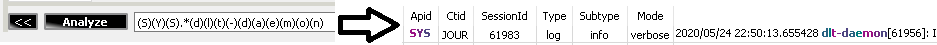
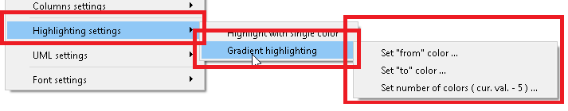
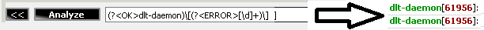
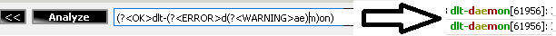
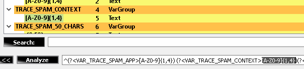
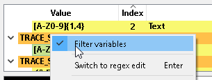
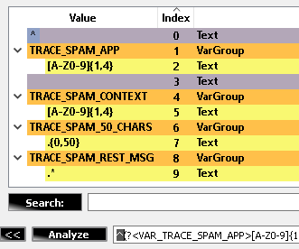

# Regex name scripting

DLTMessageAnalyzer plugin supports regex name scripting. It means, that the provided regex name might be considered by the implementation of the plugin and used by it in this or that view.

Currently, the following options are supported.

----

# Text coloring

By default, the plugin will highlight each regex group with some color. Default colors depend on the used user settings. By default, it will be a repetitive gradient consisting of 5 colors:

User can exchange the gradient settings in the context menu of the "Search view":

The default coloring can be overwritten by a regex name script.

Supported syntax options are:

RGB_R_G_B => e.g. RGB_0_0_0 stands for black:

Color name => e.g. BLACK: . Map of the supported color name is presented in below section

Status name => e.g. ERROR:

Supported statuses are:
{"ok", QColor(0,150,0)},
{"warning", QColor(150,150,0)},
{"error", QColor(150,0,0)}

Coloring of the nested groups is also supported:

All the above parameters are case insensitive.

----

# Variables

When you are working with a complex regex expression, it is quite complex to find an important part of it in order to change some parameters.

E.g. the default regex, which is used in the one of the projects where this plugin is used consists of 1831 characters.
Try to find and change something in uch a big string! It is a quite complex task.

To keep things easier, the variable scripting was introduced within the plugin. It does the following thing:

As you see above, each "VAR_TRACE_SPAM_APP" regex name will be turned into a separate item in the tree view. It allows to build "regex with parameters" and easily exchange the content of your filter:

Change in a tree view will be reflected in a final regex.

Also, selection within a tree view will select the corresponding part in the main regex input field:

If needed it is possible to switch from visualization of "Variables" to visualization of the whole regex:

All the above parameters are case insensitive.

----

# AND operator
If needed, "color" and "variable" scripting options can be combined together with the help of the "_AND_" operator. This operator is case insensitive, so you can use also "_and_", "_AnD_", etc:

----

# Supported color names

Finding! Color names split with "space" will currently not work, as regex name can't contain a space. Names will be replaced with "_" instead of " " in the next plugin's release.

{"black", QColor(0,0,0)},
{"white", QColor(255,255,255)},
{"red", QColor(255,0,0)},
{"lime", QColor(0,255,0)},
{"blue", QColor(0,0,255)},
{"yellow", QColor(255,255,0)},
{"cyan", QColor(0,255,255)},
{"magenta", QColor(255,0,255)},
{"silver", QColor(192,192,192)},
{"gray", QColor(128,128,128)},
{"maroon", QColor(128,0,0)},
{"olive", QColor(128,128,0)},
{"green", QColor(0,128,0)},
{"purple", QColor(128,0,128)},
{"teal", QColor(0,128,128)},
{"navy", QColor(0,0,128)},
{"maroon", QColor(128,0,0)},
{"dark red", QColor(139,0,0)},
{"brown", QColor(165,42,42)},
{"firebrick", QColor(178,34,34)},
{"crimson", QColor(220,20,60)},
{"red", QColor(255,0,0)},
{"tomato", QColor(255,99,71)},
{"coral", QColor(255,127,80)},
{"indian red", QColor(205,92,92)},
{"light coral", QColor(240,128,128)},
{"dark salmon", QColor(233,150,122)},
{"salmon", QColor(250,128,114)},
{"light salmon", QColor(255,160,122)},
{"orange red", QColor(255,69,0)},
{"dark orange", QColor(255,140,0)},
{"orange", QColor(255,165,0)},
{"gold", QColor(255,215,0)},
{"dark golden rod", QColor(184,134,11)},
{"golden rod", QColor(218,165,32)},
{"pale golden rod", QColor(238,232,170)},
{"dark khaki", QColor(189,183,107)},
{"khaki", QColor(240,230,140)},
{"olive", QColor(128,128,0)},
{"yellow", QColor(255,255,0)},
{"yellow green", QColor(154,205,50)},
{"dark olive green", QColor(85,107,47)},
{"olive drab", QColor(107,142,35)},
{"lawn green", QColor(124,252,0)},
{"chart reuse", QColor(127,255,0)},
{"green yellow", QColor(173,255,47)},
{"dark green", QColor(0,100,0)},
{"green", QColor(0,128,0)},
{"forest green", QColor(34,139,34)},
{"lime", QColor(0,255,0)},
{"lime green", QColor(50,205,50)},
{"light green", QColor(144,238,144)},
{"pale green", QColor(152,251,152)},
{"dark sea green", QColor(143,188,143)},
{"medium spring green", QColor(0,250,154)},
{"spring green", QColor(0,255,127)},
{"sea green", QColor(46,139,87)},
{"medium aqua marine", QColor(102,205,170)},
{"medium sea green", QColor(60,179,113)},
{"light sea green", QColor(32,178,170)},
{"dark slate gray", QColor(47,79,79)},
{"teal", QColor(0,128,128)},
{"dark cyan", QColor(0,139,139)},
{"aqua", QColor(0,255,255)},
{"cyan", QColor(0,255,255)},
{"light cyan", QColor(224,255,255)},
{"dark turquoise", QColor(0,206,209)},
{"turquoise", QColor(64,224,208)},
{"medium turquoise", QColor(72,209,204)},
{"pale turquoise", QColor(175,238,238)},
{"aqua marine", QColor(127,255,212)},
{"powder blue", QColor(176,224,230)},
{"cadet blue", QColor(95,158,160)},
{"steel blue", QColor(70,130,180)},
{"corn flower blue", QColor(100,149,237)},
{"deep sky blue", QColor(0,191,255)},
{"dodger blue", QColor(30,144,255)},
{"light blue", QColor(173,216,230)},
{"sky blue", QColor(135,206,235)},
{"light sky blue", QColor(135,206,250)},
{"midnight blue", QColor(25,25,112)},
{"navy", QColor(0,0,128)},
{"dark blue", QColor(0,0,139)},
{"medium blue", QColor(0,0,205)},
{"blue", QColor(0,0,255)},
{"royal blue", QColor(65,105,225)},
{"blue violet", QColor(138,43,226)},
{"indigo", QColor(75,0,130)},
{"dark slate blue", QColor(72,61,139)},
{"slate blue", QColor(106,90,205)},
{"medium slate blue", QColor(123,104,238)},
{"medium purple", QColor(147,112,219)},
{"dark magenta", QColor(139,0,139)},
{"dark violet", QColor(148,0,211)},
{"dark orchid", QColor(153,50,204)},
{"medium orchid", QColor(186,85,211)},
{"purple", QColor(128,0,128)},
{"thistle", QColor(216,191,216)},
{"plum", QColor(221,160,221)},
{"violet", QColor(238,130,238)},
{"magenta", QColor(255,0,255)},
{"orchid", QColor(218,112,214)},
{"medium violet red", QColor(199,21,133)},
{"pale violet red", QColor(219,112,147)},
{"deep pink", QColor(255,20,147)},
{"hot pink", QColor(255,105,180)},
{"light pink", QColor(255,182,193)},
{"pink", QColor(255,192,203)},
{"antique white", QColor(250,235,215)},
{"beige", QColor(245,245,220)},
{"bisque", QColor(255,228,196)},
{"blanched almond", QColor(255,235,205)},
{"wheat", QColor(245,222,179)},
{"corn silk", QColor(255,248,220)},
{"lemon chiffon", QColor(255,250,205)},
{"light golden rod yellow", QColor(250,250,210)},
{"light yellow", QColor(255,255,224)},
{"saddle brown", QColor(139,69,19)},
{"sienna", QColor(160,82,45)},
{"chocolate", QColor(210,105,30)},
{"peru", QColor(205,133,63)},
{"sandy brown", QColor(244,164,96)},
{"burly wood", QColor(222,184,135)},
{"tan", QColor(210,180,140)},
{"rosy brown", QColor(188,143,143)},
{"moccasin", QColor(255,228,181)},
{"navajo white", QColor(255,222,173)},
{"peach puff", QColor(255,218,185)},
{"misty rose", QColor(255,228,225)},
{"lavender blush", QColor(255,240,245)},
{"linen", QColor(250,240,230)},
{"old lace", QColor(253,245,230)},
{"papaya whip", QColor(255,239,213)},
{"sea shell", QColor(255,245,238)},
{"mint cream", QColor(245,255,250)},
{"slate gray", QColor(112,128,144)},
{"light slate gray", QColor(119,136,153)},
{"light steel blue", QColor(176,196,222)},
{"lavender", QColor(230,230,250)},
{"floral white", QColor(255,250,240)},
{"alice blue", QColor(240,248,255)},
{"ghost white", QColor(248,248,255)},
{"honeydew", QColor(240,255,240)},
{"ivory", QColor(255,255,240)},
{"azure", QColor(240,255,255)},
{"snow", QColor(255,250,250)},
{"black", QColor(0,0,0)},
{"dim gray", QColor(105,105,105)},
{"gray", QColor(128,128,128)},
{"dark gray", QColor(169,169,169)},
{"silver", QColor(192,192,192)},
{"ight gray", QColor(211,211,211)},
{"gainsboro", QColor(220,220,220)},
{"white smoke", QColor(245,245,245)},
{"white", QColor(255,255,255)}};