[**Go to the previous page**](../../README.md)

## Table of Contents

1. [Search](#search)
2. [Regex text editor](#regex-text-editor)
3. [How the search string is formed?](#how-the-search-string-is-formed)
4. [Continuous search](#continuous-search)
5. [Case sensitive search](#case-sensitive-search)
6. [Regex errors handling](#regex-errors-handling)
7. [Regex history](#regex-history)
8. [Regex group name glosssary](#regex-group-name-glossary)
9. [Used regex engine](#used-regex-engine)

----

# Search

This chapter describes the general aspects of the plugin's search functionality.

----

## Regex text editor

To search within the opened dlt file, the user should provide his input into the regex text editor:

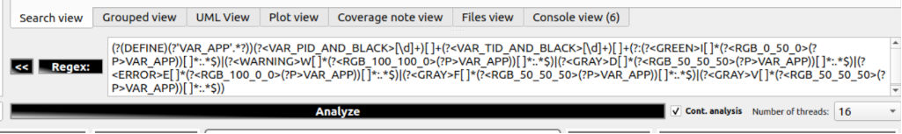

A text editor adjusts its height based on the provided content. The editor's default maximum height is four lines of text. When reached, the scrollbar will appear to allow user navigation within the complex regular expression.

The user can adjust the maximum height from 1 to 10 using the following context menu item:


----

## How the search string is formed?

The default search string is formed based on the following columns:

> **Apid + " " + Ctid + " " + Payload**

But it is possible to adjust that. More information on this topic is located [here](../search_view/search_view.md#search-columns).

----

> **Note!**
>
> Above means that you can easily: 
> - filter out messages of the specific application - e.g. ^DLTD
> - filter out messages, which originate from the specific context id of all applications - e.g. ^[\w]{1,4} CTX
> - filter out messages, which originate from the specific context id of the specific application - e.g. ^SYS JOUR
> - use your already existing regex expression, which does not consider the above filtering capabilities
>
> Together with the increased speed of the search this way of filtering becomes much more comfortable, than the usage of the usual dlt-viewer's filters.
>
> However, the search is fully compatible with the usage of the dlt-viewer's filters.

----

## Continuous search

Another thing, which differs between the "dlt-viewer's search" and the "plugin's search" is that DLT Message Analyzer allows getting the continuous updates of the search results.

Simply start the search:

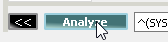

You will see, that in case if your HU is connected, the search will continue to proceed with adding more and more results:

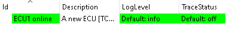

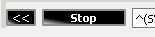

----

> **Note!**
>
> The continuous search will stop in the following cases:
> - loss of connection to the target
> - if the user presses the "Stop search" button

----

## Case sensitive search

Be default the search is case insensitive. 
But, it is easy to change that via the search input field's context menu:

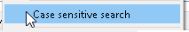

The changed setting would be persisted and applied to all the next search operations.

----

## Regex errors handling

In case if the user makes a mistake in the provided regex, the plugin will give a status bar notification with a description of the error, which was provided by the used regex engine:

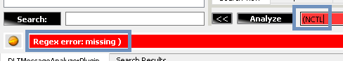

Notification message contains the col number, at which an error has occurred. In addition to that, the regex text edit will jump to the error location and will select the col number character, which contains an error. 

The same kind of error handling is also supported in the other menus, where user can enter the regexes, e.g. during the edit operation of the previously saved pattern: 

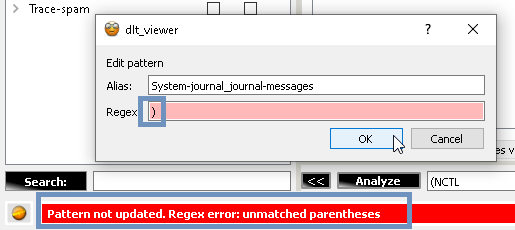

----

## Regex history

The DLT Message Analyzer plugin supports the regex history functionality:


The history is filled in from two sources:

- Regular expressions typed in by the user
- Selected pre-saved regex aliases

The main aspects of this feature are:

- The history is limited to 100 elements for each data source
- Selected pre-saved regex aliases are resolved into the text they contain once selected
- When there are no empty slots in the history, the newly added elements will remove the less relevant ones. Relevancy is calculated as a cumulative ranking based on each element's usage count and update time
- Use the 'Ctrl+Space' shortcut when the text input field is in focus to activate the feature. Also, you can activate it in the following context menu:
  
  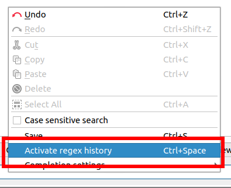
- Use the 'Esc' key to deactivate the feature

  **Note!** Alternatively, you can click past the suggestions pop-up to turn off the feature
- Use the '|' pipe character to add multiple regex history elements on top of each other
- You can search for suggestions using case-sensitive and case-insensitive types of search. You can select this option in the following context menu:
  
  
- You can search for suggestions using "Start with" or "Contains" search strategies. You can select this option in the following context menu:

  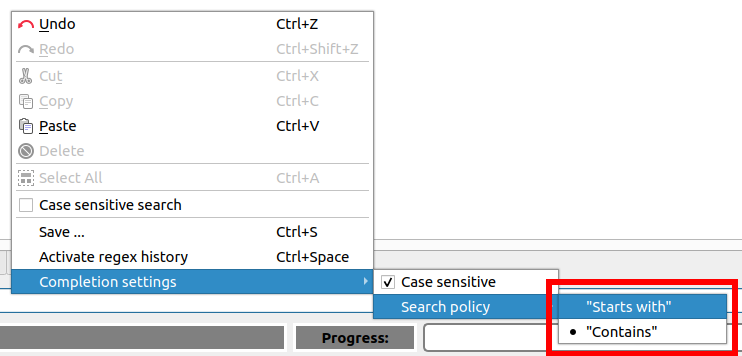
- The history is accounted for and stored per the regex patterns file. Activation of the other file will load the corresponding regex history
- The JSON with regex usage statistics is stored within the '~/.DLT-Message-Analyzer/regex_usage_statistics/' folder 

----

## Regex group name glossary

The DLT Message Analyzer plugin heavily uses the regular expression group names feature. The plugin interprets the regex group names to tokenize each regular expression group name and the text it contains and uses that data for feature-specific purposes. For example, it gets X and Y data for the plot points, method names for sequence diagram arrows, RGB codes for text highlighting, indexes for grouped view data nesting, etc.

Too many features use this mechanism, making it hard for the user to remember all supported regular expression group names without continuously cross-checking the plugin's documentation. This feature adds a glossary within the plugin so that the user can reference supported group name templates on the fly.

To use the feature:

- ( Optional ) You can select the part of the regular expression query you want to enclose with a regular expression group containing a chosen name. If the selection is empty, the regular expression will be injected with the empty content in the current cursor position.
- Make a right-click on the regular expression text edit UI element and choose the 'regex group name glossary' context menu item:

  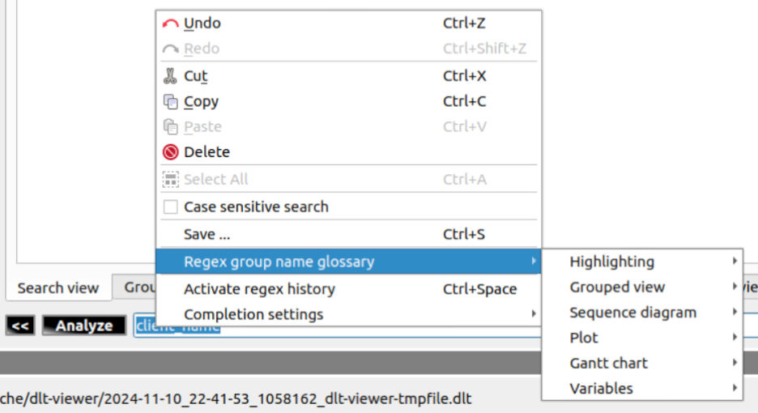

- Then select one of the features from the list. You'll see a list of sub-items that represent different possible regular expression group names that the plugin can interpret:

  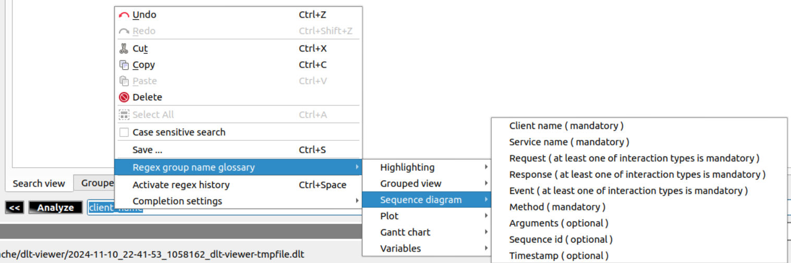

  **Note!** If the feature requires multiple regex groups to be used, the list will include 'mandatory' and 'optional' elements.

- Select any of the items to apply the selected regular expression group name:

  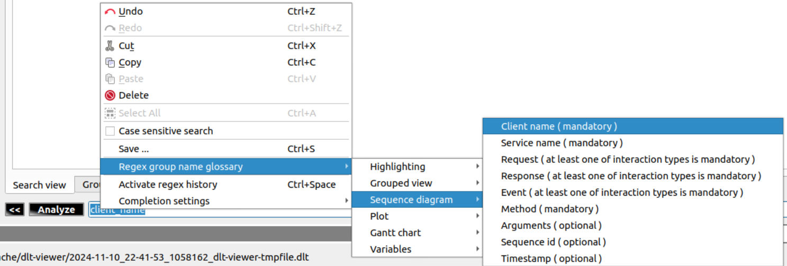

- The result would be the following:

  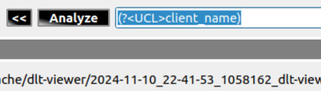

**Note!** Some regular expression group names require the user to input the parameter values. E.g. for the color, the injected regular expression group name would be the following:

```
(?<RGB_[RED]_[GREEN]_[BLUE]>colored_text)
```

The user is given a hint to input values for the RED, GREEN, and BLUE color components. The parameter names are intentionally wrapped with the '[', ']' symbols to increase readability and provoke the error if the user doesn't fill them in:

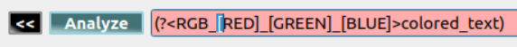

----

## Used regex engine

The plugin's implementation is using the QRegularExpression regex engine, which is a PCRE one.
It works much faster than the QRegExp, which is still used in the dlt-viewer's v.2.19.0.

Qt documentation itself tells:
>https://doc.qt.io/qt-5/qregularexpression.html#notes-for-qregexp-users
>
>The QRegularExpression class introduced in Qt 5 is a big improvement upon QRegExp, in terms of APIs offered, supported pattern syntax, and speed of execution. 

And we've checked that. It works faster and provides deeper support of the regex syntax.

----

[**Go to the previous page**](../../README.md)