[**Go to the previous page**](../../README.md)

----

# Search view

The plugin's "search view" is the analog of the dlt-viewer's "Search Results" section, meaning that its main purpose is to represent you the find result entries.
Still, there are additional things that it does on top of what the standard functionality of the dlt-viewer provides to you.

----

## How does it look?

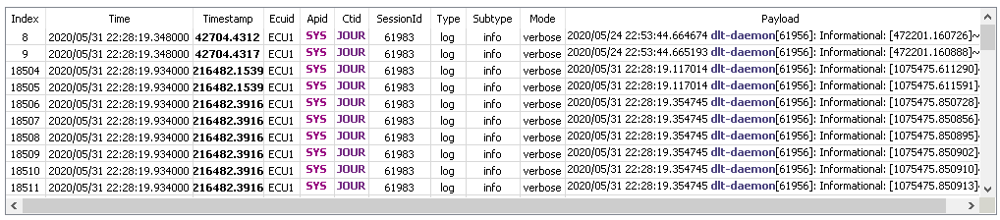

----

## Search columns

Search view allows you to select the search columns, which will be traversed during the search:

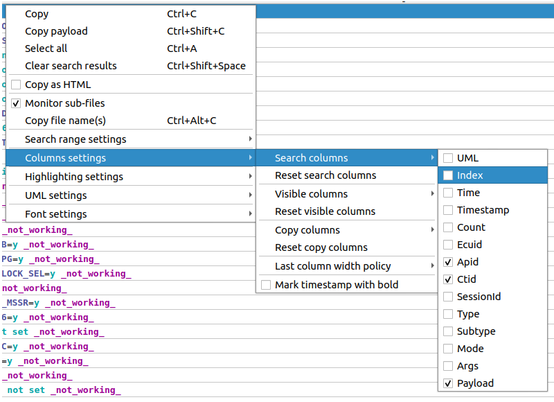

All selected columns would be concatenated in the following way:

> **SELECTED_COLUMN_1 + " " + SELECTED_COLUMN_2 + " " ... + SELECTED_COLUMN_N**

The default combination is the following one:

> **Apid + " " + Ctid + " " + Payload**

This feature allows you to search by any combination of the available columns.

Useful use-cases:

- Filter out messages from a certain ECU
- Filter out messages of ceratin type, subtype, mode
- Filter out messages by time and date

Some of this functionality you can achieve with the usual dlt-viewer's filter mechanism. But having it also in the DLT-Message-Analyzer provides more flexibility on how you work with the traces inside the plugin.

----

## Visible columns

Search view allows you to select the visible columns, which might increase the readability of the messages:

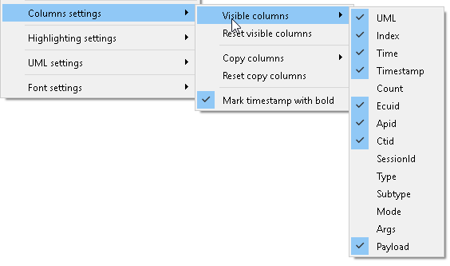

----

## Copy-paste extensions 

As in the dlt-viewer, the search view allows you to copy the whole message or only the payload:

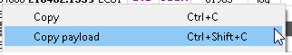

Besides that, you can select, which columns will be copied. That might help you to copy ONLY required sub-set of information:

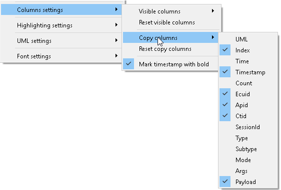

----

On top of that the "search view" allows you to copy-paste the highlighted text.
Just turn on the "Copy as HTML" option to allow copy-paste of the formatted text:

Then copy-paste any found rows into your email:

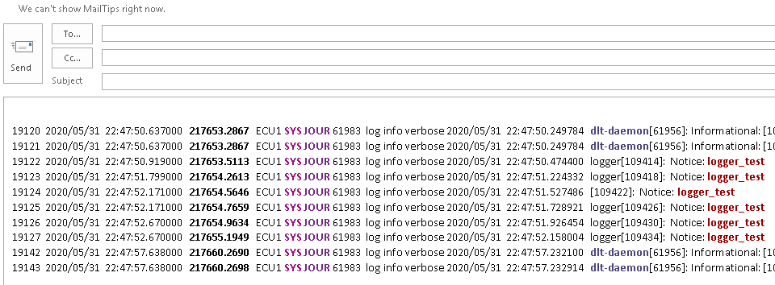

----

> **Note!**
>
> You can paste highlighted text to any application, which supports the representation of colored content, e.g. Word, Excel, Outlook, etc.
> For other text editors, plain text will be pasted.

----

## Lock the search range

Another feature of the "Search view" is called a "Lock search range".
It allows you to specify, which range of the message id-s should be considered during the search. Other messages will be skipped by the search algorithm, making it run much faster.

----

> **Note!**
>
> It helps while you work with huge DLT files.
> E.g. you have a 10 Gb DLT file with the 3 hours of tracing, while you are interested in a specific use-case, which took around several minutes.

----

There are 3 ways to specify the search range within the plugin's implementation:

- Select the already found row and specify whether it should be considered as "start search" or "end search" point:

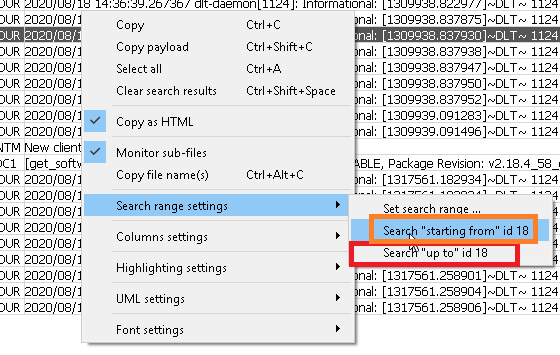

- Select 2 already found rows and specify, whether that pair should be considered as "start & end" search points:

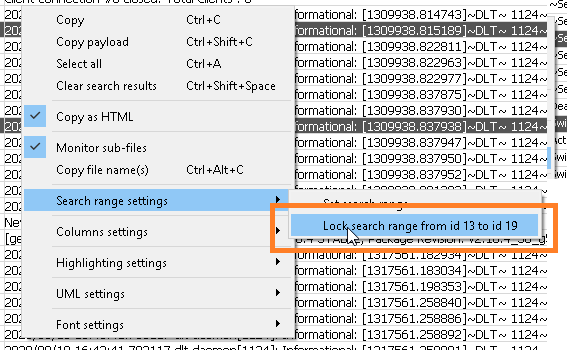

- Enter the start and end message id-s manually:

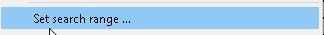

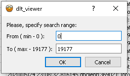

----

> **Note!**
>
> The dialog, that will appear, will show you the minimum and maximum message id-s, which are available in the loaded DLT file.

----

After the lock is not needed anymore, you can remove it using the following context-menu item:

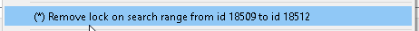

----

### Example of the applied "lock search range"

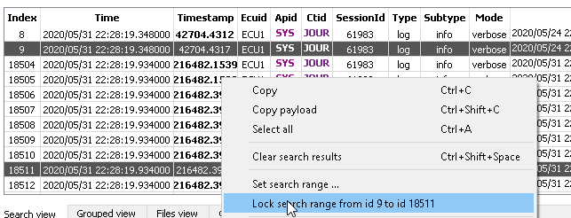

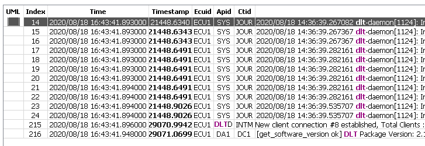

----

## Mark timestamp with bold

A small feature, which allows a search view to mark the timestamp column with bold.
Nothing special, still it is quite useful when you want to emphasize that time is an important part of the copy-pasted messages:

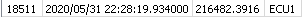

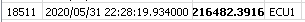

----

## Copy file name

Sometimes a developer can analyze a bunch of the files, related to the same life-cycle.
E.g. he can work with 30 files from the archive "Friday testing.zip".
In his analysis, he might want to mention which sub-set of files is related to the finding.

For this purpose plugin's implementation provides the possibility to copy file name(s) by selected message(s):

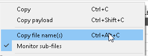

----

> **Note!**
>
> In case if more than one row is selected, the plugin will copy the names of all files within the range of the selected messages. File names are separated with '\n' symbol.

----

Due to the limitation of dlt-viewer's SW API, this feature requires some overhead to index each sub-file separately inside the plugin.
Usually, that will not cause visible side-effects, e.g. additional processing for 500 000 messages might additionally take ~1-2 seconds on i5 CPU.
Still, if needed, the feature can be turned off or on via the following context-menu:

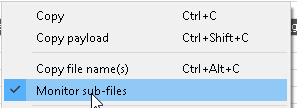

By default, feature is turned on.

----

## Last visible column width strategies

"Search view" supports different strategies regarding how to handle the width of the last visible column. The supported strategies are:

| Strategy name | Strategy meaning | Impact on the other columns |
|---|---|---|
| Reset user width | During each search the width of the last visible column is reset to the default value. Double click on the column's header will cause resize to "Fit content" width. Resize algorithm will consider 1000 lines starting from the first currently visible row. Thus, for lists with 1000+ rows, additional double clicks might be necessary. | Width of the other columns is dynamically adjusted during the scrolling. |
| Preserve user width | User width of the last visible column is preserved. It stays unchanged. | Width of the other columns is dynamically adjusted during the scrolling. |
| Fit to content | The width of the last visible column is fit to the content of the string. Initially, width considers only 1000 elements starting from the first visible element. But it is additionally dynamically adjusted during the scrolling. | Width of the other columns is dynamically adjusted during the scrolling. |

Here how the setting looks like within the plugin's context menu tree:

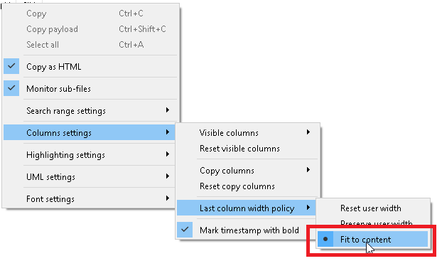

> **Note!**
>
> Default value of this setting is "Fit to content".

----

[**Go to the previous page**](../../README.md)