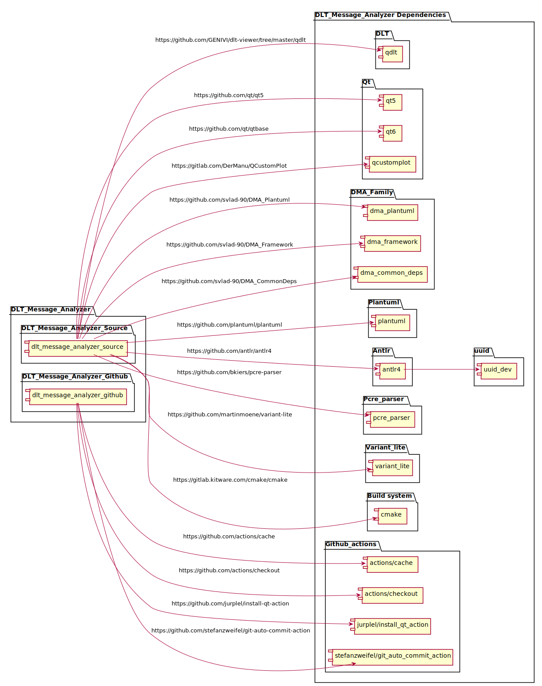

[**Go to the previous page**](../../README.md)

----

# Thirdparty dependencies

### List of the used dependencies

| Dependency name | Repository | License type | License link |
|---|---|---|---|
| dma_common_deps | [Repository](https://github.com/svlad-90/DMA_CommonDeps) | Apache 2.0 | [License](https://github.com/svlad-90/DMA_CommonDeps/blob/master/LICENSE) |
| dma_framework | [Repository](https://github.com/svlad-90/DMA_Framework) | Apache 2.0 | [License](https://github.com/svlad-90/DMA_Framework/blob/master/LICENSE) |
| dma_plantuml | [Repository](https://github.com/svlad-90/DMA_Plantuml) | Apache 2.0 | [License](https://github.com/svlad-90/DMA_Plantuml/blob/master/LICENSE) |
| qt5 | [Repository](https://github.com/qt/qt5) | (L)GPL 3.0 | [License](https://github.com/qt/qt5/blob/dev/LICENSES/LGPL-3.0-only.txt) |
| qt6 (optional) | [Repository](https://github.com/qt/qtbase) | (L)GPL 3.0 | [License](https://github.com/qt/qtbase/blob/dev/LICENSES/LGPL-3.0-only.txt) |
| qdlt | [Repository](https://github.com/GENIVI/dlt-viewer/tree/master/qdlt) | MPL 2.0 | [License](https://github.com/GENIVI/dlt-viewer/blob/master/LICENSE.txt) |
| plantuml | [Repository](https://github.com/plantuml/plantuml) | (L)GPL 3.0 | [License](https://github.com/plantuml/plantuml/blob/master/plantuml-lgpl/lgpl-license.txt) |
| antlr4 | [Repository](https://github.com/antlr/antlr4) | BSD 3-Clause | [License](https://github.com/antlr/antlr4/blob/master/LICENSE.txt) |
| pcre_parser |[Repository](https://github.com/bkiers/pcre-parser) | MIT | [License](https://github.com/bkiers/pcre-parser/blob/master/LICENSE) |
| variant_lite |[Repository](https://github.com/martinmoene/variant-lite) | Boost Software License 1.0 | [License](https://github.com/martinmoene/variant-lite/blob/master/LICENSE.txt) |
| qcustomplot |[Repository](https://gitlab.com/DerManu/QCustomPlot) | GPL-3.0 | [License](https://gitlab.com/DerManu/QCustomPlot/-/blob/master/GPL.txt?ref_type=heads) |
| nlohmann json |[Repository](https://github.com/nlohmann/json)| MIT | [License](https://github.com/nlohmann/json/blob/develop/LICENSE.MIT) |
| cmake |[Repository](https://gitlab.kitware.com/cmake/cmake) | BSD 3-clause | [License](https://gitlab.kitware.com/cmake/cmake/-/blob/master/Copyright.txt) |
| actions/cache |[Repository](https://github.com/actions/cache) | MIT | [License](https://github.com/actions/cache/blob/main/LICENSE) |
| actions/checkout |[Repository](https://github.com/actions/checkout) | MIT | [License](https://github.com/actions/checkout/blob/main/LICENSE) |
| jurplel/install_qt_action |[Repository](https://github.com/jurplel/install-qt-action) | MIT | [License](https://github.com/jurplel/install-qt-action/blob/master/LICENSE) |
| stefanzweifel/git_auto_commit_action |[Repository](https://github.com/stefanzweifel/git-auto-commit-action) | MIT | [License](https://github.com/stefanzweifel/git-auto-commit-action/blob/master/LICENSE) |

**Note** antlr4 requires at least Java SE 11 runtime during the build process to generate the C++ lexer and parser.

----

### Dependency diagram

 

----

[**Go to the previous page**](../../README.md)