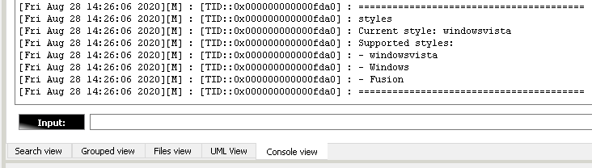
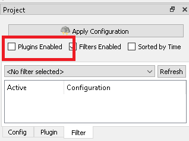
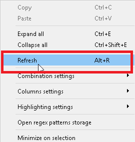

[**Go to the previous page**](../../README.md)

----

# Table of Contents

1. [Instance of dlt-viewer has an old-fashion styling](#instance-of-dlt-viewer-has-an-old-fashion-styling)
2. [When I try to perform a search within the DLT-Message-Analyzer plugin, I get the "Initial enabling error!" message](#when-i-try-to-perform-a-search-within-the-dlt-message-analyzer-plugin-i-get-the-initial-enabling-error-message)
3. [Settings collisions during simultaneous usage of the multiple plugin's instances](#settings-collisions-during-simultaneous-usage-of-the-multiple-plugins-instances)
4. [High level of the memory consumption](#high-level-of-the-memory-consumption)

----

# Troubleshooting

## Instance of dlt-viewer has an old-fashion styling

<details>
<summary>Click for more details!</summary>

The majority of the users are using dlt-viewer with the default styling, which is "windowsvista".

If you build dlt-viewer with Qt version which is equal or greater than 5.10, you should be aware that "windowsvista" styling has become a separate dynamic library there.

In order to check whether it is still available or not you can switch to the "Console view" and input "styles".
That will show you used, and available style sets:



You can select one of the available styles using the "-style" command-line option, e.g.:

> ./dlt-viewer -style Fusion

In case if "windowsvista" style is missing in the above list, you can add it to the final deployment of the dlt-viewer in the following way:
> Take it from: "&lt;Qt_ROOT&gt;\\&lt;Qt_version&gt;\\&lt;Qt_toolchain&gt;\plugins\styles\qwindowsvistastyle.dll" // or *.so, depending on the used OS.
>
> Place it to: ".\dlt-viewer\styles\qwindowsvistastyle.dll" // or \*.so, depending on the used OS.

Then reboot the dlt-viewer. The additional style should become available.
</details>

----

## When I try to perform a search within the DLT-Message-Analyzer plugin, I get the "Initial enabling error!" message

<details>
<summary>Click for more details!</summary>

In the older version the error looks like this:


In newer versions - like this:


In general, you get this error, when dlt-viewer core is not providing to the plugin a pointer to the dlt file through the plugin's API. 

It doesn't really matter whether you have opened any dlt file or not. 
Dlt-viewer always has a connection to some file:
- if you've opened the file - dlt-viewer will use it
- if you haven't opened any file - dlt-viewer will itself implicitly create and use a temporary file

But in the case when you get the above-mentioned error, something went wrong, and the file is not provided.
Another proof of that would be an empty "Files view" of the plugin:


----

**Why could that happen? We've identified the following reasons.**

----

1. You have disabled "Plugins enabled" option on dlt-viewer's "Filter" tab and restarted the dlt-viewer:



The possible measures of avoidance in this case are:
-	Turn on “Plugins Enabled” option and open another dlt file or dlt session with the target
-	Turn on “Plugins Enabled” option and then restart dlt-viewer

----

2. You have compiled a newer version of the dlt-viewer, which has a settings format incompatible with the previously used version.

There are possible measures of avoidance for this issue.

On Windows:
- Close dlt-viewer.
- Go to "C:\Users\&lt;UserName&gt;\.dlt\config"
- Remove "config.ini"
- Start dlt-viewer

On Linux:
- Close dlt-viewer.
- Go to "/home/&lt;UserName&gt;/.dlt/config"
- Remove "config.ini"
- Start dlt-viewer

If that does not help, you can also try to press "Ctrl+K" in dlt-viewer in order to reset the used file.
</details>

----

## Settings collisions during simultaneous usage of the multiple plugin's instances

<details>

<summary>Click for more details!</summary>
The current design of the plugin is made in a way, which does not consider simultaneous usage of the configuration files by multiple instances of the plugin. In other words, the behavior in the case of 2 ( or more ) running instances of the dlt-viewer is totally implementation-dependent.

We are trying to make it a part of the design, but as of now our users can rely on the following statements:
- Each instance of the plugin reads the configuration from the corresponding files to RAM and works with them in the RAM.
- When settings are changed there is one of 2 strategies applied, based on the user settings:
  1. Either the whole set of the settings is updated and written to files on each update of each setting
  2. Or values are changed only in RAM and  written to files ONLY when dlt-viewer is closed by the user
- There are no "re-read" operations applied by all instances of the plugin once the file was changed. That is planned to be added for all instances, in case if "write on each update" strategy is used. But it is not there right now.
- Everything will work as expected until your work with the configuration of the plugin consists of the read-only operations. In other words - no side-effects until settings are not changed by the user.
- If for some reason 2 or more instances of the plugin will try to write the configuration data in the totally same moment of time, it might lead to: 
  1. the crash of one of the instances. Actually, it NEVER happened, but it potentially might happen
  2. discard of operation of one of the instances, considering the "last win" strategy
- If multiple instances of the plugin are writing to the configuration in different moments of time ( 99.999% of the cases ), then the only confusing side-effect, which you might face, would be the discarded portions of the settings of some of the instances, due to the application of the "last win" strategy.

An example regarding the last point from the above list. Let's imagine that you work with 2 instances of the dlt-viewer, and you perform the following set of operations:

  1. Instance #1 - change setting X
  2. Instance #2 - change setting Y
  3. Instance #1 - close
  4. Instance #2 - close
  5. Reopen the dlt-viewer

You will face that ONLY setting Y was changed, as instance #2 was closed last, which caused an update of all the settings without considering updates of instance #1.

Once again, sooner or later such inconsistent behavior will be eliminated. But until then we propose the following measure of avoidance in order to have your settings consistent:
- Change the setting in one instance of the dlt-viewer
- Close that instance last one
- If you changed a setting and want to apply the same change to other already opened instances of the plugin, use the "Refresh" context-menu item of the "Patterns view":


</details>

----

## High level of the memory consumption

<details>

<summary>Click for more details!</summary>

The plugin's functionality is related to:

- frequent reallocation within the internal collections related to the data that is fetched as search results
- long living usage session of the plugin within the dlt-viewer
- work with the big data sets. E.g., 6000000 of results is a normal thing
- usage of many nested structures, such as a vector of maps of maps, etc.
- metadata collection with the amount of collected metadata depending on the search query ( controlled by the user )

Depending on the search query, all this can cause a high level of memory consumption.

E.g., the query "(F)requency:" which finds 6000000 search results can add ~1.5 Gb of RAM consumption. And the query "(F)(r)(e)(q)(u)(e)(n)(c)(y)(:)" can add 6-7 GB.

The issue is not even the high RAM consumption. However, returning RAM to the OS after releasing the plugin's resources is way too relaxed for the Linux OS. The plugin still occupies released memory for an infinite amount of time while no leaks are found.

In version v.1.0.30, the optimization was added for Linux OS to release the memory back to the OS in the following cases:

- the start of the search
- the finish of the search
- the cancellation of the search
- the clearance of the dlt file cache

That makes RAM consumption more predictable with no constant high consumption level.

**In cases that are not enough for your case, the DMA_TC_MALLOC_OPTIMIZATION CMake option was added.**

By default, it is turned off. If enabled, this option switches the allocator to tcmalloc. That will allow you to:

- Minimize RAM consumption. For the above case with "(F)(r)(e)(q)(u)(e)(n)(c)(y)(:)" request RAM consumption with tcmalloc is ~3-4 Gb less
- Minimize search processing time. E.g., for the "(F)requency:" query with 6000000 messages, the processing time with tcmalloc was ~9 seconds without the tcmalloc but ~6 seconds with the tcmalloc.

To use this feature, you will need to:

- install tcmalloc on your machine:
  ```
  sudo apt-get install google-perftools
  ```
- turn on the feature:
  ```
  option(DMA_TC_MALLOC_OPTIMIZATION "[
        This option enables tcmalloc RAM usage optimization.
        You will need to link dlt-viewer against tcmalloc to use this feature.
        ]" ON)
  ```
- link dlt-viewer against tcmalloc to use this feature. Add the following line at the end of the root CMakeLists.txt of the dlt-viewer project:
  ```
  target_link_libraries(dlt-viewer tcmalloc)
  ```
- Clean build the dlt-viewer to ensure that changes in CMake settings were considered
</details>

----

If the above instructions didn't help you - create a new issue [here](https://github.com/svlad-90/DLT-Message-Analyzer/issues).

----

[**Go to the previous page**](../../README.md)